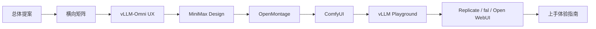

# Multimodal UX Platform Notes

这个目录用于记录多模态模型交互前端、创作平台和推理服务 UX 的调研、设计与实验。

当前重点是研究如何以 vLLM-Omni 为第一个推理 Provider，构建一个同时支持文本、图像、音频、视频以及原生多模态输出的统一交互平台，并保持平台能够适配其他推理框架。

## 研究范围

- 多模态 Playground 与模型能力发现
- 图片、视频、TTS、实时语音和 Omni 模型的统一交互
- Agent 驱动的工作流生成
- DAG/Canvas 工作流设计
- Capability Manifest 与 Schema-driven UI
- Endpoint Connection 与推理框架适配
- Run、Streaming Event 与 Asset 数据模型
- Human-in-the-loop 审核与创意生产流程
- ComfyUI、MiniMax Design、Open WebUI 等产品和生态研究

## 目录规划

```text
ux-platform/
├── README.md
├── proposals/       # 产品和技术提案
├── research/        # 竞品、用户和生态调研
├── architecture/    # 接口、数据模型和系统架构
└── experiments/     # 原型及验证记录
```

初期按实际需要逐步创建目录，避免先搭建没有内容的空结构。

## 当前文档

- [统一多模态 UX 平台提案草稿](proposals/unified-multimodal-ux-platform.md)
- [Endpoint 与传输技术备忘录](architecture/endpoint-and-transport.md)
- [相似产品研究计划](research/research-plan.md)

## 推荐阅读顺序



1. 先读[总体提案](proposals/unified-multimodal-ux-platform.md)和[横向对比矩阵](research/comparison-matrix.md)，了解目标与初步结论。
2. 再读[vLLM-Omni 现有 UX](research/vllm-omni-existing-ux.md)、[MiniMax Design](research/minimax-design.md)、[OpenMontage](research/openmontage.md)和[ComfyUI](research/comfyui.md)。
3. 然后读[vLLM Playground](research/vllm-playground.md)，了解社区项目的定位与约束。
4. 最后用 [Replicate](research/replicate.md)、[fal](research/fal.md)和[Open WebUI](research/open-webui.md)补齐平台抽象；准备实测时查看[上手体验指南](research/hands-on-evaluation-guide.md)。

时间有限时，只读：**总体提案 → 横向矩阵 → vLLM-Omni 现有 UX → MiniMax Design**。

## 后续文档规划

以下内容将在产品方向确认后按需展开：

- Capability、Run 和 Asset 数据模型
- vLLM-Omni 代表模型的协议适配
- Workflow DAG 与执行模型
