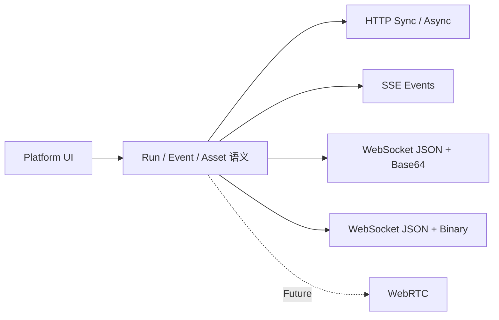

# Technical Note: Endpoint and Transport Options

> Status: Working notes  
> Purpose: preserve verified findings without treating them as an approved design

## 当前判断

第一阶段不需要公开完整 Provider SDK。平台可以先使用 `Endpoint Connection + Capability Description + 内置协议适配器`：OpenAI-compatible API 直接连接；常见特殊协议使用内置适配器；简单差异通过 HTTP 字段映射处理；复杂认证、状态机或双向媒体协议无法配置表达时，再考虑公开 SDK。

## 传输场景

| 场景 | 推荐传输 | 媒体承载方式 |
|---|---|---|
| 普通理解、图片或短音频生成 | HTTP 同步响应 | JSON、二进制或 Asset URL |
| 长视频、高分辨率图片、长音频 | HTTP 异步 Run | 轮询/SSE + Asset URL |
| vLLM-Omni 全双工语音 | WebSocket Realtime | JSON Event + Base64 音频/图像分片 |
| Helios 流式视频 | WebSocket | JSON 控制事件 + fMP4 二进制分片 |
| 未来低延迟实时音视频 | WebRTC | 原生媒体轨道 + Data Channel |

## 暂定抽象

- **Capability**：模型接受什么输入、产生什么输出以及支持哪些交互方式；
- **Run**：一次模型执行及其状态、事件、错误和结果；
- **Asset**：可以保存、预览、下载并再次作为输入的媒体产物；
- **Endpoint Connection**：模型服务地址、鉴权、协议类型和能力描述。

这些名称用于推进原型，并不代表字段和协议已经定稿。

## 待验证问题

- Capability 应由推理服务自描述，还是由平台侧注册？
- 是否需要平台代理所有媒体，还是允许浏览器直接访问服务端或对象存储？
- 不同实时协议能否映射为一致的用户可见状态？
- Asset 的所有权、过期、权限和数据驻留如何处理？
- 哪些扩展需求确实需要 Provider SDK，而不是内置适配器？
