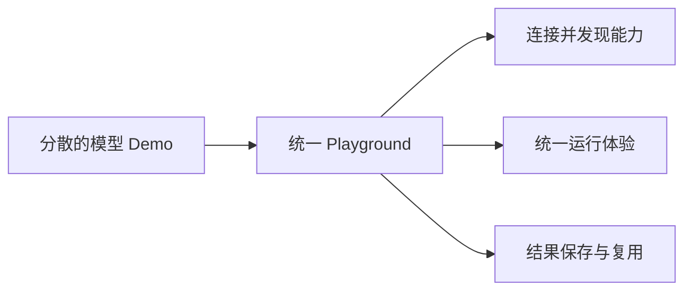
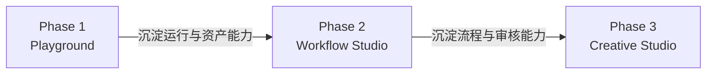
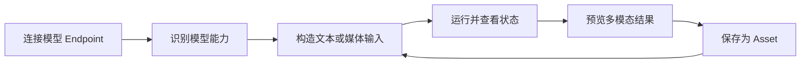
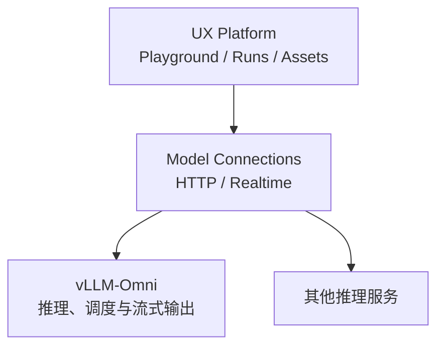

# Draft RFC: Unified Multimodal Playground for vLLM-Omni

> Status: Draft for discussion  
> Expected reading time: 5–8 minutes  
> Scope: agree on the first product step, not the final technical design

## 1. Summary

vLLM-Omni 已覆盖文本、图像、音频、视频和多模态输出，但当前体验主要分散在面向单个模型或单类任务的 Demo 中。

本 RFC 提议建设一个架构独立的 **Unified Multimodal Playground 产品层**：以 vLLM-Omni 作为首个重点推理后端，为不同模态提供统一的模型连接、输入、运行、结果展示和资产复用体验，并为未来的工作流平台保留演进空间。代码最终采用独立仓库还是生态插件形式，暂未确定。

本次希望讨论的是：**这个产品起点和边界是否正确。** 具体协议字段、数据结构等后期再定。

## 2. 当前问题

- 用户需要先知道模型名称和对应 Demo，才能找到正确入口；
- 图片、视频、TTS、全双工语音等交互方式彼此割裂；
- 模型运行结果缺少统一的历史、预览和再次使用方式；
- 每增加一种模型能力，都可能需要重新开发一套专用前端；
- 现有 Demo 能验证模型，却难以支持跨模型的完整创作流程。

## 3. 产品定位与演进

长期目标是一个面向开放多模态模型的 Workflow Studio，在发展中逐渐补全完整的 DAG、Agent 和专业创作工具。

| 阶段    | 产品形态                   | 核心定位                     | 主要用户                     |
| ------- | -------------------------- | ---------------------------- | ---------------------------- |
| Phase 1 | Multimodal Playground      | 统一体验、调试和比较不同模型 | 模型开发者、算法工程师       |
| Phase 2 | Multimodal Workflow Studio | 编排和复用多阶段生成流程     | AI 应用开发者、技术型创作者  |
| Phase 3 | AI Creative Studio         | 从创意到作品交付的一站式生产 | 设计师、视频创作者、内容团队 |

第一阶段验证的是：一套产品体验能否合理覆盖多模态模型，后续逐渐实现最终平台的全部设想。

## 4. Phase 1 核心体验

Phase 1 首要服务模型开发者和算法工程师，用于模型能力验证、参数调试、结果比较和轻量演示。

用户首先连接一个已经提供 API 的模型服务。平台根据该模型声明的能力，展示合适的输入控件和参数；用户发起运行后，可以看到状态、流式预览和最终结果，并把输出保存下来继续使用。

首版应覆盖具有代表性的体验：

- 多模态理解与对话；
- 图片生成与编辑；
- 视频生成，包括 Helios 流式预览；
- TTS 或声音克隆；
- 全双工语音；
- 一次运行返回多种模态结果。

## 5. 平台边界（待定）

平台在架构上与 vLLM-Omni 尽量解耦，通过 API 集成；最终采用独立仓库还是生态插件形式，暂未确定。

平台负责模型连接和能力呈现、输入与参数、运行状态与结果体验、多模态资产的保存和复用，以及后续的工作流和协作能力。推理服务负责模型加载、执行、资源调度、模型特有能力和推理数据输出。

首版采用轻量的 **Endpoint Connection** 思路：普通生成可通过 HTTP 接入，实时语音和流式视频允许使用 Realtime 连接。RFC 暂不要求所有后端实现统一 SDK，也不在这里确定具体协议格式。

## 6. Phase 1 范围

建议交付：

- 模型 Endpoint 的添加、测试和管理；
- 根据模型能力呈现不同模态的输入和参数；
- 统一的运行状态、取消、错误和结果页面；
- 文本、图片、音频、视频及混合输出预览；
- 运行历史与 Asset 保存、下载、再次作为输入；
- 一条“产品图片 → 脚本 → 视频与配音”的演示流程。

其中，端到端演示用于验证 Asset 能否在理解、视频和语音任务之间复用。

非目标：

- 完整 DAG Canvas；
- Agent 自动规划；
- 专业视频时间线和后期编辑；
- 面向第三方开发者的通用 Provider SDK；
- 在首版支持尽可能多的模型。

## 7. 判断成功的标准

- 用户不必寻找不同 Demo，就能完成代表性的图像、视频、语音和多模态任务；
- 不同运行方式在界面中拥有一致、可理解的状态和错误体验；
- 输出能够保存并作为后续任务输入；
- 接入新的标准模型 API 不需要重新开发一套专用页面；
- 至少覆盖普通 HTTP、实时语音和流式视频三种调用形态；
- 至少接入一个外部推理框架或标准模型 API，验证平台与 vLLM-Omni 的解耦能力；
- 第一阶段沉淀的运行和资产能力能够被后续 Workflow Studio 复用。

## 8. 当前工作假设

- Phase 1 的首要用户是模型开发者和算法工程师，主要用于模型能力验证、参数调试、结果比较和轻量演示。
- 用户添加 Endpoint 时，模型能力由服务端提供默认值，用户可以修改为自定义配置。

## 9. 本轮需要讨论的问题

1. 架构独立的产品层、vLLM-Omni 作为首个重点后端，这一边界是否合适？
2. 首版列出的六类体验是否过宽，应该优先验证哪几类？
3. Asset 应由平台托管，还是首版只保留推理服务返回的地址？
4. 项目可进入 Workflow Studio 阶段的时间。
