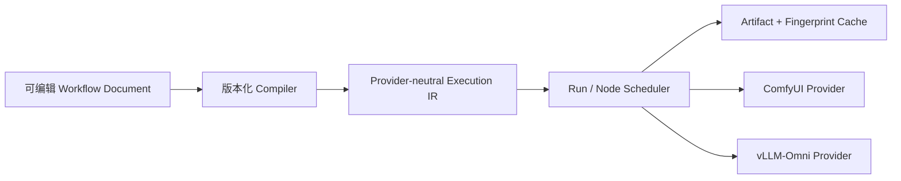

# ComfyUI 调研

> 调研日期：2026-09-06  
> 调研范围：官方文档、官方仓库源码与测试；尚未完成本轮独立安装体验。  
> 证据标签：`Verified from source` / `Official claim` / `Our inference` / `Open question` / `Hands-on pending`

## 1. 定位与结论摘要

ComfyUI 同时是本地生成式 AI 推理引擎、节点式工作流编辑器和可作为服务运行的工作流执行后端。它最强的资产是“类型化节点图 + 可序列化工作流 + 增量执行缓存 + 自定义节点生态”。

- **Verified from source**：官方开发文档将其描述为可本地运行模型、创建 workflow、开发 custom nodes 并作为 server 部署的 GenAI inference engine。
- **Our inference**：对 vLLM-Omni UX Platform，ComfyUI 最适合作为工作流协议和高级画布交互的参考，未必适合作为整个平台内核。其执行模型紧密围绕 Python 节点、进程内对象与生成式媒体依赖，企业控制面、Provider 抽象和统一 Run/Asset 模型并非其原始核心。

## 2. 目标用户与核心旅程

主要用户包括熟悉扩散模型的创作者、工作流作者、自定义节点开发者，以及通过 API 自动执行 workflow 的应用开发者。

典型旅程：选择模板或打开工作流 → 安装缺失模型/节点 → 修改 prompt、seed、采样器等控件 → 排队执行 → 在节点上观察预览和错误 → 修改局部输入后重新执行 → 保存/分享 JSON 或带 metadata 的产物。

- **Official claim**：Workflow Templates 同时提供官方支持模型流程及 custom node 示例。
- **Hands-on pending**：首次打开模板到成功生成的时间、缺失依赖修复体验、错误是否能被非专家理解。

## 3. Workflow JSON 与 API Prompt

需要特别区分两种 JSON：

1. **UI workflow JSON**：保存画布布局、节点位置、连线、widget 等编辑器信息，适合再次编辑。
2. **API prompt JSON**：供执行器消费，以 node id 为键；每个节点至少有 `class_type` 和 `inputs`，连接通常表示为 `[source_node_id, output_index]`。

简化 API prompt：

```json
{
  "3": {
    "class_type": "KSampler",
    "inputs": {
      "seed": 42,
      "model": ["4", 0],
      "positive": ["6", 0]
    }
  }
}
```

- **Verified from source**：官方执行测试把 `{"prompt": graph.finalize()}` POST 到 `/prompt`；执行器从节点的 `class_type`、`inputs` 解析定义与上游输出。
- **Verified from source**：官方仓库当前已有 `openapi.yaml`，描述 prompt、history、jobs 等接口；源码/议题同时显示 UI workflow 与执行 prompt 格式长期容易混淆。
- **Our inference**：我们的平台应把“可编辑画布文档”和“不可变执行 IR”分离，并提供显式 compiler/version；不要让 UI JSON 直接成为稳定公共执行协议。
- **Open question**：ComfyUI 新版 workflow schema、API v2/job API 的稳定性与兼容承诺需按计划采用的版本再确认。

## 4. 节点类型与执行模型

经典 server-side node 是 Python class：通过 `INPUT_TYPES()` 声明输入，以 `RETURN_TYPES` 声明输出，通过指定函数执行。节点注册进 `NODE_CLASS_MAPPINGS`。前端可据 object info 和节点元数据创建端口/widget。

- **Verified from source**：执行器根据 `class_type` 查找 class definition，验证输入、解析 link，实例化节点对象，再执行对应函数。
- **Verified from source**：执行器使用依赖图/ExecutionList，从请求的输出节点反向满足依赖；支持 lazy input、异步节点和运行时展开的 subgraph。
- **Verified from source**：官方把 custom nodes 分为 server-only、client-only、独立 client/server、互联 client/server；需要自定义前后端直连的节点不能透明用于 API mode。
- **Our inference**：类型端口非常值得借鉴，但 vLLM-Omni 平台类型应以可传输 Artifact（text/image/audio/video/json）为中心，而非任意 Python 对象，否则 Provider 可移植性会迅速丧失。

## 5. 缓存与“局部执行”

ComfyUI 的高价值体验是：重复提交工作流时，不必重新执行输入未变化且仍可复用的节点；修改下游或某个分支，其他分支可以命中缓存。

- **Verified from source**：`execution.py` 提供 classic、LRU、RAM-pressure、none 等缓存模式；输出缓存可基于输入签名，节点可通过 `IS_CHANGED` 或新版 `fingerprint_inputs` 影响变化判断。
- **Verified from source**：执行开始时会计算 cached nodes，并发送 `execution_cached`；官方测试验证重交 prompt 时输出节点可命中缓存。
- **Verified from source**：测试客户端可传 `partial_execution_targets`，执行入口内部也接受 `execute_outputs`，证明后端支持指定目标输出的部分执行路径。
- **Our inference**：“局部重跑”表示选择目标输出，并根据依赖与缓存决定最小执行集合。我们自己的 Run 模型需要记录节点级 input fingerprint、artifact lineage 和缓存策略。
- **Hands-on pending**：在 UI 中选择单节点/分支执行的发现性；改变 seed、上传图片、自定义节点版本后缓存失效是否符合用户预期。

## 6. API 与运行反馈

本地 API 的关键对象是 prompt/queue/history，WebSocket 用于进度和执行事件；常见接口包括 `/prompt`、`/ws`、`/history/{prompt_id}`、`/view`、上传、`/interrupt`、`/queue`、`/object_info`、模型列表与系统统计。

- **Verified from source**：官方测试用 `/prompt` 提交、WebSocket 接收 `executing`、`execution_error`、`execution_cached`，用 `/history/{id}` 获取输出，并通过 `/view` 拉取图片。
- **Verified from source**：`/object_info` 可暴露已加载节点定义，是 schema-driven node palette/widget 的基础。
- **Our inference**：它提供很好的执行协议样本，但媒体结果仍偏“节点自定义 output + 文件元数据”；我们的平台应在 Provider 边界归一为稳定 Artifact/Run Event。
- **Open question**：新旧 API、Cloud API 和本地 API 在认证、持久 history、重试、取消语义上的一致性。

## 7. 插件、自定义节点与模板

- **Verified from source**：自定义节点可扩展服务端计算、前端 UI，或两者；Registry 支持全局唯一名称、语义化版本、弃用与扫描/验证标记。
- **Verified from source**：Registry 中不可变的已发布版本与 workflow 记录 node version，旨在提升可复现性。
- **Verified from source**：节点包可在 `example_workflows/` 提供 JSON 和同名缩略图，服务端经 `/api/workflow_templates` 汇集；官方模板作为独立依赖更新。
- **Official claim**：Manager/Registry 支持发现、安装和评价节点。
- **Our inference**：值得借鉴“插件包附带示例模板”和版本锁定；但 Python 插件可执行任意代码，平台必须有信任等级、权限提示、依赖隔离和服务端白名单，不能只靠社区评分。

## 8. 多模态、资产与平台工程

ComfyUI 已从图像扩展到视频、音频等节点生态，但其通用性主要来自节点而非一个强制统一的跨模态领域模型。

- **Verified from source**：节点可以声明多种输入输出类型，API history 保存节点输出，生成文件通过 view/asset 元数据访问。
- **Our inference**：中间预览贴在节点上很适合创作者；长期素材库、搜索、权限、留存、跨 workflow lineage 仍应由独立 Asset Service 负责。
- **Open question**：新版 Asset API、用户隔离、Cloud workspace 与本地多用户安全边界。

## 9. 优点、局限与可复用性

### 值得借鉴

- 类型端口与从输出反向求依赖。
- 参数变化后的增量执行和缓存反馈。
- JSON 可分享、模板一键上手、插件随附范例。
- 节点级进度、预览、错误定位。
- UI document 与 API execution payload 的转换经验（也包括其历史痛点）。

### 不建议照搬

- 将任意 Python 对象作为跨节点公共数据契约。
- 把 UI workflow JSON 直接当长期稳定 Provider-neutral IR。
- 默认信任可执行第三方插件。
- 用纯节点画布作为所有新手的唯一入口。

### 复用/集成判断

- **Our inference**：优先做 ComfyUI Provider 或 workflow import/export，而不是 fork 为平台内核。
- 可考虑复用其工作流交互范式；具体前端代码复用须另查前端仓库许可证、组件耦合和版本策略。

## 10. 建议的亲自体验任务

1. 从空白画布完成文生图，记录第一次成功耗时与认知负担。
2. 用官方模板完成图生视频或视频任务，观察缺失模型处理。
3. 只改 prompt、seed、上游图片，分别观察哪些节点重跑/命中缓存。
4. 选中单一输出或分支执行，观察 UI 是否准确表达局部执行范围。
5. 安装一个 Registry 节点、载入其模板、锁定/升级版本，再模拟缺失节点。
6. 导出 UI workflow 与 API format，对比信息损失和可移植性。
7. 通过 API 提交、监听 WS、取消并读取 history；检查音频/视频输出形式。

重点评分：新手首次成功、画布可解释性、局部重跑、错误恢复、模板复用、插件安全、API 可编程性、多模态展示。

## 11. 对 vLLM-Omni UX Platform 的设计影响



最重要的启示是将“局部重跑和中间结果”设计为底层执行能力，而非画布装饰；同时不要把 ComfyUI 的节点类型直接提升为跨框架协议。

## 12. 来源

- [ComfyUI Developer Overview](https://docs.comfy.org/development/overview)
- [Custom Nodes Overview](https://docs.comfy.org/custom-nodes/overview)
- [Workflow Templates](https://docs.comfy.org/custom-nodes/workflow_templates)
- [Registry Overview](https://docs.comfy.org/registry/overview)
- [ComfyUI execution.py](https://github.com/Comfy-Org/ComfyUI/blob/master/execution.py)
- [Execution tests](https://github.com/Comfy-Org/ComfyUI/blob/master/tests/execution/test_execution.py)
- [ComfyUI OpenAPI](https://github.com/Comfy-Org/ComfyUI/blob/master/openapi.yaml)
