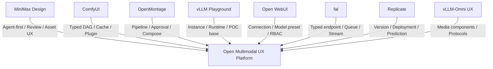
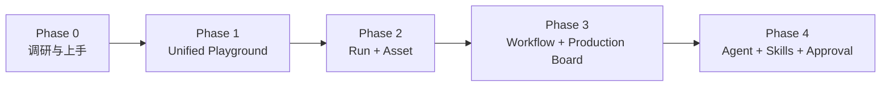

# Multimodal UX Platform Comparison Matrix

> Status: First-pass synthesis  
> Last reviewed: 2026-09-06  
> Evidence: official documentation and source review; hands-on sessions remain pending

## 1. Executive conclusion

没有一个参考项目同时覆盖我们需要的四层能力：创作者友好的 Agent 入口、可检查的多模态 Workflow、开放 Provider、生产级 Run/Asset。合理方向是组合吸收各项目的优势：

当前方向已经明确为独立平台：先验证 Capability Manifest、Provider Adapter、Unified Run 和 Asset ingestion。vLLM Playground 保留为参考、合作或集成对象，但不是平台内核的默认候选。

## 2. 产品定位

| 项目 | 第一用户 | 核心对象 | 默认入口 | 与我们关系 |
|---|---|---|---|---|
| vLLM Playground | 模型开发者/平台用户 | Instance、Model、Chat | 服务管理/模型交互 | 最接近 POC 基础 |
| vLLM-Omni Existing UX | 模型/API 开发者 | 模型 Demo/API | 模型文档与专用 Demo | 组件与协议来源 |
| MiniMax Design | 创作者/商业内容团队 | Brief、Canvas、Asset、Skill | Agent Brief | 产品体验标杆 |
| ComfyUI | 高级生成用户/节点作者 | Node、Workflow、Output | Canvas/Template | DAG 与插件参考；Provider 候选 |
| OpenMontage | 视频创作者/Agent 用户 | Pipeline、Project、Artifact、Decision | 编码 Agent Prompt | 视频生产、审核和合成参考 |
| Open WebUI | 个人/团队 Chat 用户 | Connection、Model、Chat | Chat | Provider、RBAC、会话参考 |
| fal | 生成媒体开发者 | Endpoint、Request、Workflow | Model Playground/API | 云 Provider；任务协议参考 |
| Replicate | AI 应用开发者/模型作者 | Model、Version、Deployment、Prediction | Model Playground/API | 云 Provider；资源模型参考 |

## 3. 能力对比

符号：`强` 为核心成熟能力，`中` 为已支持但不是完整核心，`弱/无` 为明显不足；当前主要依据源码与官方资料，待亲自体验校准。

| 维度 | vLLM Playground | vLLM-Omni UX | MiniMax Design | ComfyUI | Open WebUI | fal | Replicate |
|---|---|---|---|---|---|---|---|
| 统一模型交互 | 强 | 弱 | 中 | 中 | 强 | 强 | 强 |
| 图片/视频/音频 | 中 | 强 | 强 | 强 | 中 | 强 | 强 |
| 原生多输出 | 弱 | 强但分散 | Official claim | 节点可表达 | 弱 | Schema 可表达 | Schema 可表达 |
| Agent-first | 弱 | 无 | 强 | 弱 | 中 | 弱 | 弱 |
| 可视化 Workflow | 无 | ComfyUI 集成 | 强 | 强 | 无 | 中 | 无 |
| 局部重跑/缓存 | 无 | Runtime 内部 | 待实测 | 强 | 无 | 待确认 | 单 Run 重试为主 |
| Human review | MCP 审批局部支持 | 无统一层 | 强 | 手动操作 | 工具审批局部支持 | 待确认 | 无 |
| Provider 可替换 | 中 | vLLM-Omni 专用 | 弱/未知 | 节点式 | 强 | 平台 API | 平台 API |
| Runtime 管理 | 强 | CLI/配置 | 隐藏 | 本地/Cloud | 连接为主 | Serverless | Deployment |
| 持久 Run | 弱 | 视频局部支持 | 待实测 | Prompt/history | Chat turn 为主 | Queue request | Prediction 强 |
| Asset 管理 | 弱 | 分散 | 强（官方宣称） | 中 | 附件型 | 临时 URL | 临时 URL |
| RBAC/团队 | 弱 | 无 | 企业能力待确认 | 非核心 | 强 | 商业平台 | 商业平台 |
| 插件生态 | MCP/集成为主 | ComfyUI node | Skill/Plugin 未公开 | 强 | 强 | Endpoint生态 | Model生态 |
| 可观测性 | 强 | Stage metrics | 用户侧未知 | 执行反馈 | 管理能力 | 平台日志/成本 | Deployment metrics |

## 4. 最值得借鉴的设计

| 项目 | 借鉴点 | 不宜照搬 |
|---|---|---|
| vLLM Playground | 多实例 Registry、启动/连接/诊断、快速分发、vLLM-Omni Studio 起点 | 全局状态、硬编码模型/表单、base64 Gallery、单体后端 |
| vLLM-Omni UX | AudioWorklet、MSE Player、Realtime clients、各模态 API 参考 | 每模型独立页面、协议直接泄漏到 UI |
| MiniMax Design | Agent-first、Canvas-second、检查点、Skill、Asset Center | 闭源供应商绑定和未验证的内部协议 |
| ComfyUI | typed ports、依赖执行、缓存、部分执行、节点版本和模板 | 任意 Python 对象/代码插件、安全隔离弱、UI JSON 即执行协议风险 |
| OpenMontage | Pipeline Manifest、Stage Skill、Capability Preflight、Decision Log、Approval、Backlot、Composition | 以编码 Agent/仓库文件驱动状态、视频领域限定、AGPL 复用边界 |
| Open WebUI | Connection、Model preset、用户/组权限、Chat/VLM、扩展入口 | 用 Chat/Message 承载长视频 Run、DAG 和资产 lineage |
| fal | typed endpoint 自动产生 Playground、Queue/Direct/Stream/Realtime 分层、workflow events | 将托管云实现细节变成平台核心、仅复制三态队列 |
| Replicate | Model→Version→Deployment→Prediction、异步为主、Schema/Example、取消/Webhook | 临时媒体 URL 当作永久资产、把单 Prediction 当 Workflow |

## 5. 对核心抽象的证据

### 5.1 Capability Manifest

- fal 与 Replicate 证明 typed/OpenAPI schema 可以驱动表单与文档；
- ComfyUI `/object_info` 证明节点定义可以驱动 palette/widget；
- vLLM Playground 的硬编码说明缺少 capability metadata 会导致模型扩展触及前端；
- Open WebUI 的 model picker 说明仅有 model ID 不足以表达生成媒体任务。

结论：Manifest 至少需要 task、input/output modality、parameter schema、examples/presets、streaming mode、native multi-output、provider extensions。

### 5.2 Unified Run

- Replicate Prediction 是最清晰的持久运行对象；
- fal 展示 Queue、Direct、SSE、Realtime 是不同 transport/durability 等级；
- vLLM-Omni 同时存在同步、SSE、raw bytes、WebSocket 和异步视频 Job；
- ComfyUI 展示节点级执行、缓存与部分执行。

结论：Run 应与等待方式和 transport 分离，并支持 attempt、cancel、partial output、node status 与 event sequence。

### 5.3 Asset

- MiniMax Design 把本地资产中心放在主流程；
- fal/Replicate 的临时媒体 URL 说明 Provider 输出必须被平台摄取；
- vLLM-Omni base64/文件/stream 多形态说明前端附件不足以成为统一资产；
- ComfyUI 表明节点输出 lineage 对局部重跑有价值。

结论：Asset 必须独立于 Chat message，记录 MIME、尺寸/时长、校验和、来源 Provider、Run/node lineage 和保存状态。

### 5.4 Workflow

- ComfyUI 证明 typed DAG、模板、缓存和部分执行价值；
- MiniMax Design 证明普通用户更适合 Agent-first，而不是空白 Canvas-first；
- fal workflow events 证明节点事件适合进度 UI；
- Open WebUI 证明工具链不等于内容生产 Workflow。
- OpenMontage 证明低层 DAG 上方还需要面向用户目标的 Production Pipeline、成本计划、审核点与最终 Compose。

结论：先统一单 Run，再引入 Workflow IR；Canvas document 与 execution IR 分离，Agent 是 Workflow author，不是唯一执行引擎。

### 5.5 Production、Decision 与 Approval

- OpenMontage 的 append-only decision log 为 Provider、模型、预算和渲染路径提供审计轨迹；
- Storyboard/contact-sheet gate 把审核放在昂贵批量生成和最终渲染之前；
- Backlot 表明默认 Production Board 可以比 DAG 更适合创作者；
- FFmpeg、Remotion 与 HyperFrames 表明生成媒体之后仍需要 Composition/Delivery 工具层。

结论：长期模型应支持 `Project Run → Stage Run → Model/Tool Run`，并把 Decision、Approval 与 Asset lineage 作为一等对象。Playground POC 暂不实现完整视频制作，但基础数据模型不应阻断该方向。

## 6. 推荐产品路径

### Phase 1 POC

- 以 vLLM-Omni 为首个 Provider；
- 独立实现最小平台内核，同时把 vLLM Playground 作为交互参考；
- 注册 Qwen3-Omni、图片、视频、TTS 和 native video+audio 代表模型；
- 前端从 Capability Manifest 生成输入、参数和输出组件；
- 将 REST/SSE/WebSocket/async video 适配为统一 Run Events；
- 将输出摄取为可复用 Asset。

### 暂不进入首版

- 完整视频时间线编辑；
- 任意第三方前端插件系统；
- 大规模模型市场；
- 通用 Agent 编排框架；
- 将用户 Workflow 映射成 vLLM-Omni 内部 PipelineConfig。

## 7. 首轮亲自体验优先级

1. vLLM Playground：验证安装、Omni Studio、多实例、状态与失败；
2. vLLM-Omni Existing UX：验证媒体组件与各协议差异；
3. ComfyUI：验证模板、类型、缓存、部分执行和插件；
4. MiniMax Design：验证 Agent-first、Canvas、审核与 Asset；
5. OpenMontage：验证 Pipeline、Backlot、Decision/Approval、Checkpoint 与 Compose；
6. Open WebUI：验证 Connection、Model preset 与 RBAC；
7. fal/Replicate：用小额任务验证 Schema、Queue/Prediction、取消、媒体保存。

详细步骤见 `hands-on-evaluation-guide.md`。

## 8. 尚未解决的问题

- 是否与 vLLM Playground 保持 Provider/模型配置层面的兼容或合作；
- vLLM-Omni 服务端是否应原生暴露 Capability endpoint；
- 第一目标用户是模型开发者、平台工程师还是内容创作者；
- Asset 默认 local-first 还是 object-store-first；
- Workflow IR 是否兼容/导入 ComfyUI；
- Provider 的部署管理是否属于统一接口还是 extension；
- POC 的真实硬件、模型下载和媒体生成成本。

## 9. 当前建议

采用独立平台作为默认方向，以 vLLM-Omni 为首个旗舰 Provider。先制作 Capability + Unified Run + Asset 的小型原型；vLLM Playground 用于参考、互操作与潜在合作，不作为长期架构前置依赖。OpenMontage 则作为后续 Production Workflow、审核和合成层的重要参考。
