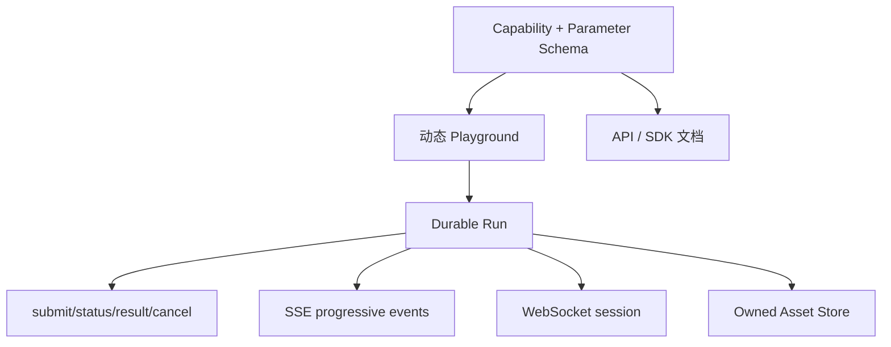

# fal 调研

> 调研日期：2026-09-06  
> 调研范围：fal 官方文档；未登录控制台、未产生付费推理。  
> 证据标签：`Verified from source` / `Official claim` / `Our inference` / `Open question` / `Hands-on pending`

## 1. 定位与结论摘要

fal 是面向生成式媒体的模型 API 与 Serverless GPU 平台。其产品连接了两条路径：用户从模型目录直接调用预部署模型；开发者将任意 Python 推理服务部署成带类型 schema、Playground、队列、流式和弹性伸缩的 endpoint。

- **Verified from source**：官方 Serverless 教程中，Pydantic Input/Output 定义部署 API，运行后同时得到 HTTP endpoint 与 Web Playground；部署后由平台管理 runner 并自动伸缩。
- **Our inference**：fal 最值得我们学习的是“同一 typed endpoint 同时驱动文档、Playground 与 SDK”，以及 queue/direct/stream/workflow 几种调用模式的清晰分层。

## 2. 用户与核心旅程

两类主要旅程：

1. 应用开发者：浏览模型 → 在 Playground 调参数/上传素材 → 复制 SDK/cURL → 异步调用 → 保存媒体结果。
2. 模型开发者：编写 `fal.App` 与 Pydantic schema → 本地 run → 使用自动 Playground 验证 → deploy → 配置伸缩并监控。

- **Official claim**：平台聚焦 image/video/audio 等生成媒体，并提供预训练模型与自部署应用的一致调用体验。
- **Hands-on pending**：模型搜索/比较、Playground 首次生成、费用提示、历史与结果复用的实际体验。

## 3. Schema 与 Schema-driven Playground

自部署端点以 Pydantic `BaseModel` 定义输入/输出，Field 可带 description、example、约束；媒体使用 toolkit 类型并返回 URL、content type、尺寸等结构。

- **Verified from source**：官方 image generator 示例用 typed Pydantic `Input`、`Output`，部署同时创建浏览器 Playground。
- **Verified from source**：官方说明 richer schemas 可表达 slider、image upload、multiple outputs。
- **Our inference**：这验证了 Capability Manifest/JSON Schema 驱动 UI 的可行性，但 schema 只描述字段形状还不够；我们的规范还需任务语义、modality、streaming、成本/资源、安全、Provider 扩展与 UI hint。
- **Open question**：fal Playground 使用的完整 schema 方言、条件字段/union、跨字段校验和版本兼容策略。

## 4. Queue 与请求生命周期

fal 推荐异步 Queue：提交后得到 `request_id` 与 status/response/cancel URL；请求状态为 `IN_QUEUE`、`IN_PROGRESS`、`COMPLETED`。可轮询、订阅状态或 webhook 获取结果。

- **Verified from source**：队列为持久队列；`IN_QUEUE` 暴露位置，`IN_PROGRESS` 可返回日志，`COMPLETED` 表示结果可取。
- **Verified from source**：队列请求在特定 runner 失败（503/504/连接错误）时自动重排与重试，官方当前文档称最多 10 次；同一 request id 继续跟踪。
- **Verified from source**：取消不是第四个可轮询状态；API 返回 `CANCELLATION_REQUESTED` 或 `ALREADY_COMPLETED`。排队任务立即移除，运行中任务收到取消信号。
- **Our inference**：三态对简单 API 足够，但我们的跨节点 Run 需要显式 terminal `failed/cancelled`、重试 attempt、取消确认、部分成功与节点状态；不能直接复制 fal 状态枚举。
- **Open question**：结果/状态的保存期、取消在 GPU kernel 或不响应 handler 时的最终保证。

## 5. Direct、Streaming 与 Realtime

fal 将交互方式区分为：

- queue `submit/subscribe`：持久、可查状态、可自动重试；
- direct `run`：同一 HTTP 连接快速返回，不经过持久队列；
- stream：单请求、服务端到客户端的 SSE 渐进输出；
- realtime：基于 WebSocket 的双向持久连接。

- **Verified from source**：官方 Streaming 文档定义 SSE，适合 token、diffusion preview、3D 中间结果；Realtime 用二进制 msgpack/WebSocket，适合连续交互。
- **Verified from source**：direct run/stream 绕过 queue，因此没有 queue 状态、自动重试与轮询能力。
- **Our inference**：统一 UX 不应把所有任务强塞进一个 transport。Provider SDK 应暴露 capability：durable async、server stream、bidirectional realtime，并在 UI 上呈现不同恢复保证。
- **Hands-on pending**：网络断开后 stream 恢复、预览到最终媒体的替换方式、视频逐步播放体验。

## 6. Workflow Endpoint

fal Workflow 把多个模型步骤封装为单一 endpoint，由平台传递上一步输出；stream 会给出节点级中间事件。

- **Verified from source**：workflow stream 事件包括 `submit`、`completion`、`output`、`error`；事件携带 `node_id`，submit 含 app/request id，completion 含单步 output，最终 output 含流程结果。
- **Verified from source**：官方示例把图像生成、移除背景、贴纸转换串为一个 workflow endpoint。
- **Official claim**：用户可管理 workflow library，并按名称、标题和所用 endpoint 搜索/过滤。
- **Our inference**：事件模型简洁且适合 UI 进度，但公开示例主要展示有向串联；复杂 DAG 的条件、并行、循环、人审、节点重试和版本语义需另验。
- **Open question**：Workflow 编辑器的持久 schema、版本冻结、子流程、节点缓存与部分重跑能力。

## 7. Serverless 与部署模型

- **Verified from source**：`fal.App` 可声明 machine type、requirements、`setup()`、keep-alive、min/max concurrency；`setup()` 用于一次性加载模型，账户持久存储可缓存权重。
- **Official claim**：部署 runner 自动伸缩，按使用计算成本；同一基础设施服务 queue 与 direct 请求。
- **Our inference**：fal 把应用开发接口和基础设施打包得很好，但这是托管平台。我们若主打私有化，应把这些抽象映射到 vLLM/vLLM-Omni deployment，而不复制其云控制面全部功能。
- **Hands-on pending**：cold start、并发排队、部署日志、版本更新与费用控制体验。

## 8. 输出、媒体与 Webhook

- **Verified from source**：不同模型保持 model-specific output schema；图片常返回包含 URL/width/height/content_type 的对象，视频与音频也返回对应媒体对象或 URL。
- **Verified from source**：媒体 URL 有过期设置，重要文件需在过期前下载。
- **Verified from source**：queue submit 可附 `webhook_url`；完成后 POST `request_id`、status 和 payload；失败投递可能重试，因此消费者需按 request id 幂等。
- **Our inference**：Provider 返回的短期 URL 不应成为平台资产。平台要主动摄取到自有 Asset Store，并保存来源、MIME、尺寸、时长、校验和与 lineage。

## 9. 优点、局限与可复用性

### 值得借鉴

- 一个 schema 同时服务 API、SDK、文档和 Playground。
- 持久异步队列及便利 URL/handle。
- 明确区分 queue、direct streaming 和 realtime。
- Workflow 节点级事件和中间结果。
- 媒体输出结构化，而不是仅返回裸字符串。

### 不建议照搬

- 将 `COMPLETED` 同时承载成功/错误后再由 payload 解释。
- 让外部临时 URL 充当长期资产。
- 把托管 Serverless 的实现假设写进 Provider-neutral workflow。
- 初版同时复制完整模型市场与云部署系统。

### 集成判断

- **Our inference**：fal 适合作为云 Provider；适配器应实现 async submit/status/result/cancel、SSE 与媒体摄取。工作流最好仍由我们控制，除非用户显式选择“下推到 fal Workflow”。

## 10. 建议的亲自体验任务

1. 在同一 Playground 分别运行 image、video、audio 模型，记录 schema 控件与多输出展示的一致性。
2. 对一个视频请求分别使用 subscribe、submit+poll、webhook，观察排队、日志、取消与错误。
3. 运行带中间结果的 Workflow，检查节点事件是否能支持 DAG 进度图。
4. 自部署最小 typed app，增加 enum、range、optional image、list/multiple outputs，观察 Playground 自动生成质量。
5. 制造 validation error、runner error、断开 SSE、重复 webhook，测试恢复和幂等。
6. 检查历史、媒体留存、下载、费用预估和团队权限。

重点评分：首次成功、schema UI、长任务状态透明度、流式体验、错误恢复、成本可理解性、工作流可调试性。

## 11. 对 vLLM-Omni UX Platform 的设计影响

建议吸收 fal 的 typed endpoint 思路，但增加清晰的 `failed/cancelled` 终态、attempt 记录、资产摄取和跨 Provider 能力降级说明。

## 12. 来源

- [Deploy Your First Image Generator](https://docs.fal.ai/documentation/development/getting-started/deploy-your-first-image-generator)
- [Asynchronous Inference](https://fal.ai/docs/documentation/model-apis/inference/queue)
- [Understanding Requests](https://fal.ai/docs/documentation/deployment/requests)
- [Streaming Endpoints](https://fal.ai/docs/documentation/development/streaming)
- [Workflow Endpoints](https://fal.ai/docs/documentation/model-apis/workflows)
- [Webhooks](https://fal.ai/docs/documentation/model-apis/inference/webhooks)

