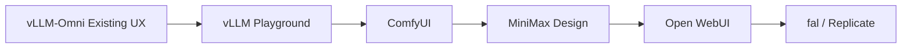

# Hands-on Evaluation Guide

> Status: Draft  
> Purpose: 为多模态 UX Platform 竞品调研提供统一、可重复的上手体验方法。

## 1. 为什么需要亲自体验

官网、README 和演示视频主要说明产品希望如何被理解；真实上手体验才能回答：

- 第一次使用是否知道从哪里开始；
- 完成一个任务需要理解多少模型概念；
- 不同模态是否真正使用同一套交互；
- 流式过程、失败、取消和重试是否自然；
- 中间素材和工作流是否容易复用；
- 产品在 Demo 成功路径之外是否仍然可靠。

所有体验记录必须区分：

- `Verified by experiment`：亲自操作确认；
- `Official claim`：官方宣称，尚未实测；
- `Our inference`：根据现象推断；
- `Blocked`：因账号、硬件、额度或环境限制未能完成。

## 2. 统一体验任务

尽量在不同产品中使用相同素材和目标，便于横向比较。

### Task A：第一次成功

目标：从打开产品开始，完成一次最简单的生成或对话。

记录：

- 是否需要安装、登录、配置 API Key 或下载模型；
- 从进入产品到第一次成功经历多少步骤；
- 是否需要事先理解模型、Provider、Endpoint 或采样参数；
- 默认值能否直接成功；
- 首次失败时提示是否可操作。

### Task B：多模态理解

上传一张统一测试图片，要求：

```text
描述图片中的主体、环境和视觉风格，并生成三条适合短视频的广告文案。
```

记录输入方式、上传反馈、结果结构、历史保存和再次编辑体验。

### Task C：图片生成与编辑

使用固定 Prompt 生成图片，再上传结果要求修改背景或风格。

记录：

- 生成与编辑是否属于同一项目；
- 参数是否面向任务还是暴露底层模型实现；
- 多个候选结果如何比较；
- Seed、参考图和配置能否复用；
- 中间结果是否自动进入素材库。

### Task D：视频与音频

根据同一张参考图片生成短视频，并生成一段配音。

记录：

- 视频是否异步执行；
- 是否显示排队、进度、预计时间和中间预览；
- 是否可以取消和重新生成；
- 视频与音频能否在同一个项目中组合；
- 原生视频加音频输出与多模型组合在 UI 中如何区分。

### Task E：复用

把已经完成的过程保存并更换输入再次运行。

记录：

- 保存单位是会话、模板、Workflow、Skill 还是 Project；
- 能否锁定部分参数，只替换素材；
- 是否支持复制、版本和分享；
- 其他用户是否能理解并运行该流程。

### Task F：失败恢复

主动提供一种无效输入或取消正在运行的任务。

记录：

- 错误发生在哪一层；
- 已完成的中间结果是否保留；
- 能否只重试失败步骤；
- 是否需要从头重新生成；
- 是否能看到足够的诊断信息。

## 3. 每个项目重点体验什么

### 3.1 vLLM Playground

重点问题：它能否成为我们的基础，而不只是参考。

必测功能：

1. 从 UI 启动或连接一个 vLLM 服务；
2. 注册并切换多个本地或远程实例；
3. 使用 VLM 上传图片并对话；
4. 使用其 vLLM-Omni Studio 完成图片、语音或音乐任务；
5. 查看 Observability 和 Benchmark 页面；
6. 检查模型列表来自 `/v1/models`、静态配置还是内部 Registry；
7. 观察新增模型是否需要修改前端代码；
8. 测试服务停止、连接失败和推理取消。

特别关注：

- Studio 是否已经存在通用 Capability 抽象；
- 图片、音频和文本是否共用统一 Run 模型；
- 视频和一次调用多个输出是否容易加入；
- 前端、服务管理和 Provider 是否耦合；
- 是否适合扩展、贡献或合作。

### 3.2 vLLM-Omni Existing UX

重点问题：现有 Demo 中有哪些交互和代码可以复用。

必测功能：

1. Qwen3-Omni 或 MiniCPM-o 多模态 Gradio；
2. 通用图片生成和编辑 Gradio；
3. Helios 流式视频 Demo；
4. Qwen3-TTS 或 VoxCPM2 无缝流式语音；
5. PersonaPlex 或 MiniCPM-o 实时语音浏览器客户端；
6. ComfyUI-vLLM-Omni 示例工作流。

特别关注：

- 各 Demo 重复实现了哪些组件；
- API、流式协议和错误处理有哪些差异；
- 哪些模型特例阻碍统一；
- 自定义 AudioWorklet、MSE Player 等媒体组件能否复用；
- 模型能力是否能由服务端自动发现。

### 3.3 MiniMax Design

重点问题：如何把复杂多模态工作流包装成创作者可以理解的产品。

必测功能：

1. 从自然语言 Brief 创建一个项目；
2. 观察 Agent 如何拆解脚本、分镜、图片、视频和音频任务；
3. 打开 Canvas，检查自动生成的节点和连接是否可理解；
4. 在中间检查点否定结果并提出修改；
5. 将成功流程保存或复用为 Skill；
6. 查看本地素材中心和文件导出；
7. 尝试从自动模式切换到手动模型选择。

特别关注：

- 默认界面是 Agent 还是 Canvas；
- 普通用户什么时候需要看到 DAG；
- Agent 做了哪些自动选择，是否解释原因；
- 审核点如何防止昂贵的无效生成；
- Project、Asset、Workflow 和 Skill 之间是什么关系。

### 3.4 ComfyUI

重点问题：成熟节点工作流的能力与学习成本。

必测功能：

1. 从模板完成一次文生图；
2. 将生成结果接入放大、编辑或视频节点；
3. 保存、导出、导入并重新运行 Workflow；
4. 安装一个 Custom Node；
5. 修改节点参数并比较输出；
6. 主动造成缺失模型、类型错误或节点执行失败；
7. 使用 vLLM-Omni 节点连接远程服务。

特别关注：

- 节点端口类型如何定义和校验；
- Workflow JSON 中 UI 状态与执行状态是否耦合；
- 节点插件权限和依赖如何管理；
- 模板如何降低新手门槛；
- 中间结果、缓存和局部重跑如何呈现。

### 3.5 Open WebUI

重点问题：统一 Provider、模型、用户和会话的成熟体验。

必测功能：

1. 连接一个 OpenAI-compatible 服务；
2. 自动发现并切换模型；
3. 上传图片进行 VLM 对话；
4. 创建多个会话并搜索历史；
5. 配置工具、知识库或 Pipeline；
6. 测试普通用户与管理员视角。

特别关注：

- Provider 配置与模型展示如何分离；
- 模型能力不足时如何处理；
- 会话、用户和权限模型是否可借鉴；
- Chat 优先的信息架构对创作平台有哪些限制。

### 3.6 fal

重点问题：多模态模型 API 与异步生产任务的开发者体验。

必测功能：

1. 从模型目录选择图片或视频模型；
2. 在 Playground 观察自动生成的输入控件；
3. 发起一个异步任务并观察队列、状态和结果；
4. 使用 Workflow Endpoint 串联两个步骤；
5. 比较模型通用字段与模型专有字段；
6. 查看请求日志、成本和错误信息。

特别关注：

- 模型 Schema 如何驱动 Playground；
- Queue、Webhook、Streaming 如何组合；
- Workflow 是平台 DAG 还是封装后的单一 Endpoint；
- Serverless 部署细节对用户暴露多少。

### 3.7 Replicate

重点问题：Model、Version、Deployment 和 Prediction 抽象是否适合借鉴。

必测功能：

1. 从模型页运行一次 Prediction；
2. 查看输入 Schema、状态、日志、输出和耗时；
3. 使用 API 创建并查询 Prediction；
4. 取消一个运行任务；
5. 查看模型版本与 Deployment 的关系；
6. 检查输出文件保存期限和复用方式。

特别关注：

- Prediction 是否可以成为我们 Run 模型的参考；
- 模型版本如何保证工作流可复现；
- API Playground 如何从 Schema 自动生成；
- 模型市场与私有 Deployment 如何共存。

## 4. 单次体验记录模板

每次实际体验创建一条 Session Record：

```markdown
## Session: <project> / <task>

- Date:
- Tester:
- Product version/commit:
- Environment:
- Account/plan:
- Model/provider:
- Task:
- Result: success / partial / failed / blocked
- Time to first success:

### Steps

1.
2.
3.

### Friction points

-

### Unexpected strengths

-

### Failure and recovery

-

### Evidence

- Screenshot:
- Log/API request:
- Source link:

### Implications for our platform

- Borrow:
- Avoid:
- Prototype:
```

## 5. 统一评分卡

评分只用于辅助比较，不能代替事实记录。每项 1–5 分，并附一句理由。

| 维度 | 评分问题 |
|---|---|
| 首次成功 | 新用户能否快速得到第一个有效结果？ |
| 概念负担 | 是否必须理解大量模型和部署概念？ |
| 多模态一致性 | 不同模态是否遵循一致的交互语言？ |
| 高级控制 | 专业用户能否访问必要的模型参数？ |
| 流式体验 | 是否清晰、连续并且可以中止？ |
| 失败恢复 | 是否保留成果并支持局部重试？ |
| 工作流复用 | 是否容易保存、修改、分享和重放？ |
| 素材管理 | 输入、中间产物和成品是否统一管理？ |
| Provider 扩展 | 是否容易接入新模型或推理框架？ |
| 可观测性 | 是否能理解延迟、资源、日志与成本？ |

## 6. 体验顺序

建议按以下顺序进行，先建立基线，再研究更复杂的创作体验：



第一轮不要求穷尽所有功能。每个产品完成指定必测任务、收集关键证据并能够回答研究问题后即可停止。

## 7. 第一轮体验后的决策输出

体验完成后不直接决定最终 UI，而是回答：

1. vLLM Playground 是否适合作为基础项目；
2. vLLM-Omni 哪些现有组件值得抽取；
3. 默认入口应是 Chat、Task、Agent 还是 Canvas；
4. 第一版是否需要 DAG；
5. Capability Manifest、Run 和 Asset 最小模型是什么；
6. 哪一条用户旅程最适合用于 POC；
7. 哪些判断仍需要技术原型验证。

