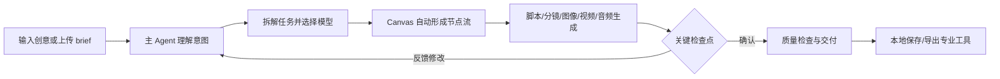
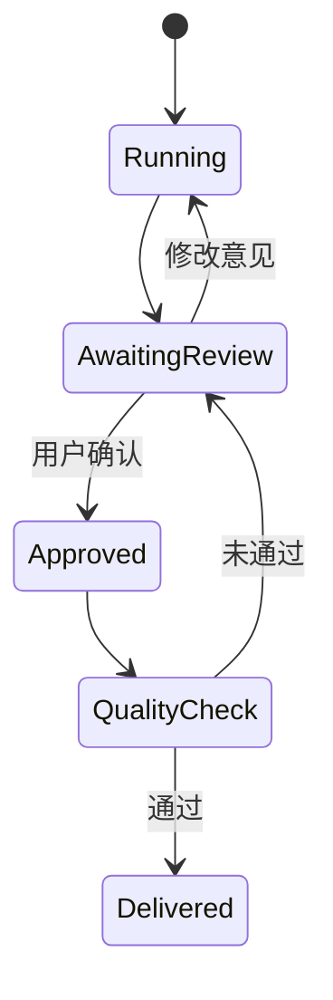

# MiniMax Design 调研

> 调研日期：2026-09-06  
> 调研方式：官网与公开资料审阅；尚未安装桌面客户端实测  
> 证据状态：以 **Official claim** 为主；文中明确标记推断与待验证项

## 1. 结论摘要

MiniMax Design（官网称 MiniMax Design）定位为面向短剧、电商、品牌 TVC、广告创意等场景的桌面端 AI 内容生产平台，覆盖范围超过单模型 Playground。它把产品主线组织为五步：创意输入与 Agent 执行、Canvas 多模态节点流、Skills/Plugins 复用、本地素材桥接、人工审核与交付。

对我们的最大价值不在视觉样式，而在三项产品判断：

1. 默认入口可以是自然语言 brief，由 Agent 先生成任务图，而不是要求新用户先画 DAG；
2. Canvas 是可检查、可干预的执行计划，也是脚本、分镜、图像、视频、音乐和编辑产物的共同工作区；
3. 创作流程需要资产索引与人工检查点，不能只提供“一次模型请求—一次结果”。

**Our inference**：如果我们的目标是开放推理生态版创作平台，MiniMax Design 是产品体验标杆，但不是适合直接复用的技术底座。vLLM-Omni 的差异点应是开放模型、自托管、Provider 可替换以及推理性能可观测。

## 2. 基本信息与定位

- 产品地址：[MiniMax Design 官网](https://hub.minimax.io/)
- 产品形态：macOS 13+、Windows 10+ x64 桌面应用。
- 开源情况：未发现公开源码或公开 SDK；插件协议和运行时边界尚不清楚。
- 目标用户：内容创作者以及短剧、电商、品牌 TVC、广告创意生产团队。
- 核心定位：本地多模态 AI 创作工作室，通过 Agent 编排文本、图像、视频等模型完成端到端生产。

**Official claim**：官网明确称其为 “local multimodal AI creative studio” 和 AI-native creation platform，并强调从 creative direction、Agent execution 到 review、delivery 的连续流程。

**Open question**：“local”具体覆盖哪些层次——素材本地存储、工作流本地运行、插件本地执行，还是模型本地推理——官网当前材料不足以确认。

## 3. 核心用户旅程

**Official claim**：用户只需描述想法或投入 brief，主 Agent 会读取意图、拆解任务并自动匹配模型，同时保留手动选模型能力。Canvas 节点会自动连接，覆盖研究到最终剪辑；关键节点会向用户请求方向确认。

**Our inference**：这是“Agent-first、Canvas-second”的渐进式复杂度设计。Canvas 将 Agent 的黑箱计划显性化，并为高级用户提供介入入口。

## 4. Agent 入口

值得关注：

- brief 输入是否支持文本、图片、文件、链接等混合上下文；
- Agent 如何把模糊创意转换为任务地图；
- 自动模型选择是否给出理由、成本与耗时预估；
- 用户能否锁定模型、风格、角色或品牌规则；
- 修改一句自然语言要求后，是全图重建还是局部更新。

**Official claim**：主 Agent 可理解意图、拆解任务并自动匹配最佳模型，也允许手动选择。

**Hands-on pending**：任务拆解质量、可解释程度、对已有 Canvas 的增量修改、失败恢复、成本确认与取消机制均需实测。

## 5. Canvas 与 DAG

**Official claim**：同一 Canvas 支持 script、storyboard、video、music、editing，节点自动连接，并覆盖从 research 到 final cut 的流程。

**Our inference**：Canvas 很可能同时承担工作流图和多媒体白板两类职责。对我们而言需要明确分离：

- Workflow IR：机器可执行的节点、端口、依赖和状态；
- Canvas document：位置、分组、批注、预览和用户编辑状态；
- Asset lineage：产物由哪个 Run、节点和输入产生。

**Open questions**：

- 是否真的是严格 DAG，还是允许反馈环、对话节点或时间线结构？
- 节点端口是否有 text/image/audio/video 类型检查？
- 是否支持并行、条件、批量映射、局部重跑、缓存与版本回滚？
- Agent 生成的节点图能否导出为开放格式？

## 6. Skills 与 Plugins

**Official claim**：用户可通过聊天构建自定义 Skill，可从 Plaza 一键使用成熟工作流；专业插件用于增强 VFX 和简化复杂制作。

这提示了三个不同抽象，不宜混为一谈：

| 抽象 | 对我们的可能定义 |
|---|---|
| Template | 带默认参数的可复制 Workflow |
| Skill | 封装领域流程、提示词、工具和验收规则的可复用能力 |
| Plugin | 给平台增加 Provider、节点、工具或 UI Renderer 的代码扩展 |

**Open questions**：Skill 是否包含可执行代码、版本与依赖；Plugin 的 API、权限、隔离、审核和分发机制；Plaza 是否同时销售工作流和模型能力。

**Hands-on pending**：从现有 Canvas 创建 Skill、安装 Plaza Skill/Plugin、升级后兼容、共享范围和卸载行为。

## 7. Asset 与 Local-first

**Official claim**：Canvas 资产自动保存到本地，图片和工作流集中索引；Agent 能访问本地文件，并可一键导出至专业工具。

值得借鉴的是把 Asset 设为一等对象，而不是消息附件。建议我们的 Asset 至少包含：

- modality、MIME、尺寸/时长等元数据；
- 来源 Run、节点、模型、参数、seed 与父资产；
- 本地或对象存储 URI；
- 预览、版本、标签和项目权限。

**Open questions**：音频和视频是否也全部自动索引；跨设备同步如何处理；Agent 访问本地目录的授权粒度；是否存在代理文件、去重和迁移策略；“secure management”是否有加密、沙箱或审计支撑。

## 8. 人工审核与质量环

**Official claim**：Agent 会在关键检查点请求用户方向；Agent + Harness 会加载领域知识并进行多轮质量检查。

**Our inference**：这是区别于一般推理 Playground 的关键能力。平台的 Run 状态不能只有 running/succeeded，而应允许：

**Hands-on pending**：检查点由模板、Agent 还是用户设置；修改后局部重算边界；质量规则是否可见和可编辑；多人审批与批注是否支持。

## 9. 多模态能力与输出管理

**Official claim**：官网列出 COPY+、IMAGE+、VIDEO+、AUDIO+、EXPORT+、MANAGE+，并展示电商、产品发布、汽车广告等案例。Canvas 明确涉及脚本、分镜、视频、音乐与编辑。

**Open question**：具体模型清单、一次调用的原生多输出能力、流式音视频预览、声音克隆、视频编辑范围和导出格式，需要客户端实测。

## 10. 部署、多租户与扩展边界

公开材料主要面向桌面创作体验，尚不足以确认：

- 团队项目、RBAC、素材共享、审计；
- 私有化部署与自定义推理端点；
- GPU 任务队列、配额、成本和可观测性；
- 第三方模型 Provider 是否开放；
- Workflow/Skill 的 API 化和批量执行。

这些恰好可能成为开放平台的差异化空间。

## 11. 对我们的启示

### 建议借鉴

1. 自然语言 brief 作为默认入口，Agent 生成可见工作流。
2. Canvas 同时呈现流程、中间资产和结果，但底层执行 IR 与 UI 文档分离。
3. 脚本、分镜、首帧、成片前设置可恢复的人工检查点。
4. Asset lineage 和本地/私有存储作为平台核心，而非后补功能。
5. 将成熟流程封装成 Skill，让用户复用“电商广告生产”而不是底层节点集合。

### 不建议照搬

1. 不把平台锁定到单一厂商模型和隐式模型路由。
2. 不在第一版同时建设完整视频编辑器、插件市场和 Agent 自动导演。
3. 不以营销中的“本地优先”等同于本地推理或数据绝不出端。
4. 不先复制 Canvas 视觉样式；先验证 Capability、Run、Asset 和检查点模型。

### 需要 POC 验证

- 一条“产品图 → 脚本/分镜 → 视频 + 配音 → 人工审核”的固定流程；
- 修改脚本后只重跑下游节点；
- vLLM-Omni 与另一个 Provider 能否运行同一份 Workflow IR；
- 同一 Run 同时管理 video、audio、text 多个输出。

## 12. 建议的上手体验任务

安装客户端后优先完成以下任务，并录屏/截图记录：

1. **首次成功**：只输入一句商品广告 brief，记录到首个可用结果的时间、自动生成的节点和 Agent 追问。
2. **可控性**：手动替换一个模型、锁定风格，再用自然语言修改工作流，观察是否覆盖手动修改。
3. **局部重跑**：在视频生成后修改配音，验证是否只重跑音频/合成节点。
4. **审核点**：否决脚本或分镜，给出修改意见，观察状态与资产版本。
5. **资产复用**：把已有本地图片拖入新项目，检查索引、来源与导出。
6. **Skill/Plugin**：安装 Plaza 项目并创建自己的 Skill，记录权限、依赖和可移植性。
7. **失败恢复**：断网、取消长视频生成、重启客户端，观察任务与资产是否恢复。

建议重点量化：首次结果时间、用户决策次数、无效昂贵生成次数、局部重跑范围、跨项目复用步骤数。

## 13. 参考资料

- [MiniMax Design 官方产品页](https://hub.minimax.io/)：产品定位、五步工作流、目标场景和桌面下载要求。
- [MiniMax Design Tutorial（官网链接）](https://my.feishu.cn/)：当前官网跳转入口；具体教程访问内容需在实际客户端体验时补充核验。
