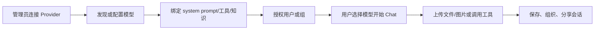
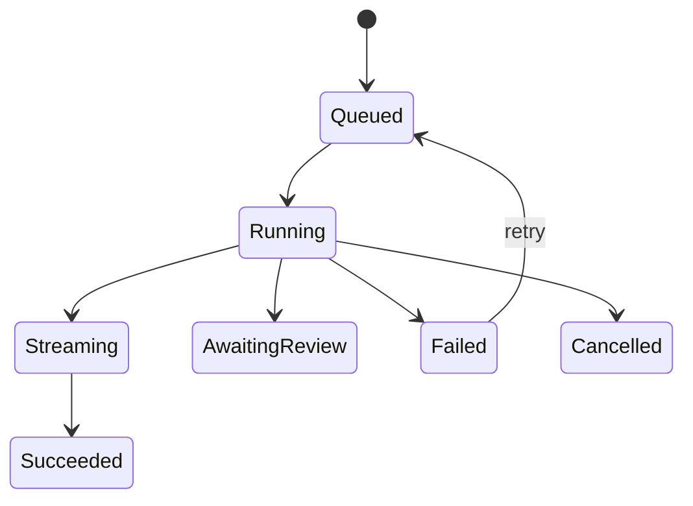

# Open WebUI 调研

> 调研日期：2026-09-06  
> 调研方式：官方文档、官方 GitHub 仓库与安全文档审阅；尚未进行本地部署体验  
> 证据状态：官方文档与公开源码可验证的机制标记为 **Verified from source**；体验项标记为 **Hands-on pending**

## 1. 结论摘要

Open WebUI 是成熟的自托管 AI 交互与团队工作空间，核心体验仍是 Chat。它的优势在统一 Provider 连接、模型/Agent 包装、会话与知识资源、用户/组权限，以及 Tools、Functions、OpenAPI/MCP 扩展生态。

它很适合参考或复用以下平台能力：模型列表与访问控制、连接管理、Chat/VLM 输入、会话组织、模型 preset、工具与外部服务集成。它不直接解决多媒体创作平台的核心问题：可视化 DAG、长时异步媒体 Run、丰富多输出、资产 lineage、分镜/时间线以及人工审核。

**Our inference**：Open WebUI 可作为 Provider、权限和 Chat UX 的重要参考，或成为 vLLM-Omni 的一个轻量聊天入口；若以其为创作平台底座，需要重构核心数据模型和 UI，而不仅是增加一个 Pipe/Tool。

## 2. 基本信息与定位

- 项目地址：[open-webui/open-webui](https://github.com/open-webui/open-webui)
- 官方文档：[docs.openwebui.com](https://docs.openwebui.com/)
- 产品形态：自托管 Web 应用，连接 Ollama、OpenAI-compatible 及其他 Provider。
- 目标用户：个人、本地模型用户、团队和需要统一 AI Chat 工作空间的组织。
- 核心对象：Connection、Model/Agent preset、Chat、Message、Knowledge、Prompt、Tool、Function、User、Group。

**Verified from source**：官方仓库包含前端与 Python 后端；官方文档描述了多用户部署、模型访问控制、插件、知识库、Notes 和 Channels。

## 3. 核心用户旅程

默认入口是模型选择 + 对话，而不是任务模板或 Canvas。这降低了文本/VLM 模型首次使用门槛，但也使复杂媒体生产更容易被压缩成“聊天中调用工具并返回附件”。

## 4. Provider 与模型发现

**Verified from source**：

- Open WebUI 支持配置 Ollama 和 OpenAI-compatible connections；自托管 vLLM 通常可通过 OpenAI-compatible API 接入。
- Pipe Function 可注册为模型选择器中的新“模型”，用于非标准 Provider、路由或多步骤逻辑。
- 官方扩展文档给出多 Provider 路由示例：通过 Pipe 将 Anthropic、Vertex AI、自托管 vLLM 放进统一模型选择器。
- Models/Agents 是对 base model 的配置包装，可绑定 system prompt、tools、knowledge 和 generation parameters，并可限制用户/组访问。

**Our inference**：其模型发现主要围绕“可聊天模型 ID + 能力开关/配置”，不是严格的多模态 Capability Manifest。对于 image.generate、video.generate、speech.generate 及多输出模型，需要比 model picker 更丰富的输入/输出 schema。

**Open questions**：不同 OpenAI-compatible 后端的 capability 探测是否一致；模型参数表单有多少来自服务端 schema、多少为平台硬编码；未知多媒体 endpoint 如何注册和呈现。

## 5. Chat、VLM 与媒体能力

**Verified from source**：官方功能与权限文档覆盖文件上传、图片生成、STT、TTS、Audio Call、屏幕捕获、多模型同时响应等能力；Chat 可结合 Knowledge、Web Search、Memory、Notes 和代码执行工具。

Open WebUI 的多模态优势是把图片/文件上下文自然带入对话，并将许多能力作为模型可调用工具。局限在于其主要渲染和生命周期仍围绕 message turn：

- 图片、音频或文件多为消息内容或附件；
- 不天然表达一个 Run 同时输出视频、音频、字幕与中间资产；
- 长视频排队、取消、断点恢复和分阶段重试不是核心交互；
- 缺少脚本、分镜、节点关系与时间线的共同工作区。

**Hands-on pending**：使用 vLLM VLM 完成图片问答；接入 image generation；测试 TTS/STT；观察大文件、长输出和多个模型并行响应的失败与恢复体验。

## 6. 会话、用户与权限

**Verified from source**：

- 角色至少包括 admin、user、pending；管理员可控制新用户默认角色。
- 权限分为 Workspace、Sharing、Chat、Features、Settings 等类别。
- 支持 groups 与 per-resource access grants；模型、知识、Prompt、Tool、Skill 等资源可配置访问与分享权限。
- Chat 支持文件夹、导入、分享与临时会话相关权限。
- API key 继承创建用户权限，并可限制允许调用的 API endpoint。
- 多用户规模化部署文档建议 PostgreSQL、Redis、外部向量数据库与共享存储。

这部分是我们建立团队平台时非常值得借鉴的能力面，特别是模型/资源级授权，而不只是“是否能登录”。

**Our inference**：创作平台还需要 Project/Workspace、Asset、Workflow、Run、审批记录等资源权限；直接复用 Chat 资源授权模型可能不足。

## 7. Tools、Functions、Pipelines 与扩展机制

**Verified from source**：Open WebUI 当前主要有两层扩展机制：

| 层 | 能力 | 运行位置 |
|---|---|---|
| Tools / Functions | Tool 调用；Pipe 新增 Provider/模型；Filter 拦截消息；Action 添加消息按钮 | Open WebUI 进程内 |
| OpenAPI / MCP | 把外部 HTTP 服务作为工具暴露给模型 | 独立服务 |

Pipelines 是旧的独立 worker 扩展框架，官方当前文档将其标为 legacy，并称已由 Functions 和 Tools 取代。

Functions 的主要类型：

- Pipe：注册新模型或自定义请求处理逻辑；
- Filter：通过 inlet/outlet/stream 修改输入输出；
- Action：在消息下增加用户触发按钮。

Tools 为模型提供外部 API/操作；OpenAPI/MCP 适合 GPU、重依赖、强隔离或独立扩缩容的服务。

**Verified from source（安全）**：Tools 与 Functions 可在服务端执行任意 Python，拥有与 Open WebUI 进程相同的文件、网络和环境变量权限；官方要求只安装可信来源并限制创建/导入权限。外部服务可以提供更好的隔离。

**对我们的启示**：Provider 插件、Workflow 节点、Agent Tool、UI Renderer 应采用不同接口和权限模型，不应都塞进“插件”一个概念。GPU 推理 Provider 应进程外运行。

## 8. Run 与 Streaming

**Verified from source**：Chat 支持流式响应；Filter 存在 stream 钩子；后端为异步架构，长时等待型 Tools/Functions 不阻塞其他用户，同步/CPU 工作可在线程池执行。

**Our inference**：这仍不等价于媒体生产所需的持久化 Run 模型。我们至少需要：

并把 `Run` 与 chat message 解耦，以支持后台任务、刷新后恢复、进度、取消、webhook、多输出和局部重跑。

**Hands-on pending**：长时 Tool/Pipe 在刷新页面、断线、重启后是否保持；取消是否传播到上游 Provider；流式非文本输出如何渲染。

## 9. Asset 管理

**Verified from source**：Open WebUI 提供文件、Knowledge、Notes 等内容对象，并允许在 Chat 中附加或由 Agent 检索；Chat 可导入/导出和按文件夹组织。

**Our inference**：这些对象服务于对话上下文和 RAG，不等价于创作资产中心。媒体平台需要缩略图、代理文件、时长/尺寸、版本、派生关系、模型与参数 provenance、跨项目复用和专业工具导出。

## 10. 对创作平台的适配度与限制

| 维度 | Open WebUI 适配度 | 判断 |
|---|---:|---|
| Chat/VLM | 高 | 核心体验成熟 |
| Provider 连接 | 高 | OpenAI-compatible、Pipe 及外部服务机制成熟 |
| 用户/组/RBAC | 高 | 值得参考 |
| Tools/Agent 扩展 | 高 | 生态丰富，但必须处理代码执行安全 |
| 图片生成 | 中 | 已有能力，但以 Chat/工具交互为主 |
| TTS/STT/Audio Call | 中 | 有入口，需验证对 vLLM-Omni 协议适配 |
| 视频生成 | 低 | 缺少专门长任务与流式媒体工作台 |
| 多输出 Run | 低 | Message 模型不够表达原生多输出与子状态 |
| Workflow DAG | 低 | 没有面向用户的通用节点画布 |
| Asset lineage | 低 | 文件/知识对象与创作资产模型目标不同 |
| Human-in-the-loop | 低 | Chat 可反馈，但缺少显式审核状态和下游阻塞 |

## 11. 对我们的启示

### 建议借鉴

1. Provider connection 与模型/Agent preset 分离：连接负责凭据和 endpoint，preset 负责提示词、工具、知识、参数与访问权限。
2. 用户、组、模型和资源级授权，以及 API key endpoint 限制。
3. Chat/VLM 作为统一平台中的一个工作区，而非整个平台唯一的数据模型。
4. 进程内轻量扩展与进程外 OpenAPI/MCP 服务分层；GPU Provider 独立部署。
5. Pipe、Filter、Action 的职责分解对 Provider、事件拦截和 UI Action 设计有参考价值。

### 不建议照搬

1. 不把所有模型能力都伪装成 chat completion 或 Tool。
2. 不把长时生成 Run 绑定到单条 Message 生命周期。
3. 不让第三方扩展默认与主进程共享完整权限。
4. 不用“模型选择器”取代 Capability Manifest 和 schema-driven task UI。
5. Pipelines 已被官方标为 legacy，不应作为新平台扩展架构依据。

### 可复用/集成路径

- 最轻：把 vLLM-Omni 的 Chat/VLM/TTS 能力接入 Open WebUI，作为现有用户入口。
- 中等：参考其 Connection、Model preset 与 RBAC 设计，但独立实现 Run/Asset/Workflow。
- 不推荐：直接 fork 并把 Canvas、视频生产和资产中心塞入现有 Chat 核心；改造面和长期合并成本可能很高。

## 12. 建议的上手体验任务

1. **Provider 首次接入**：连接一个 vLLM OpenAI-compatible endpoint，记录从 URL/API key 到模型出现所需步骤。
2. **模型发现与配置**：新增/移除模型，创建 model preset，绑定 Prompt、Knowledge 和 Tool，并配置用户组权限。
3. **VLM Chat**：上传图片并连续追问，观察文件保存、引用和会话复用。
4. **媒体能力**：体验 image generation、STT、TTS、Audio Call，记录它们是原生内容块还是 Tool 附件。
5. **扩展**：安装一个 Tool、Pipe、Filter、Action，并查看代码、权限、设置和卸载行为。
6. **长任务恢复**：运行慢 Tool，刷新页面、断开网络、取消请求，观察后台状态和上游取消。
7. **多用户**：建立两个用户和一个 group，验证模型、Tool、Knowledge、Chat 分享边界。
8. **vLLM-Omni 探针**：尝试将图像、视频、TTS endpoint 作为 Pipe/OpenAPI Tool 接入，记录 UI 与协议中必须写特例的部分。

建议重点量化：首次接入时间、模型新增是否需写代码、权限配置步骤、长任务可恢复性、每种媒体的专用 UI 完整度。

## 13. 关键开放问题

- Open WebUI 当前版本对 OpenResponses 及多模态内容块的实际支持范围如何？
- vLLM-Omni 视频/音频流能否无需自定义前端 Renderer 即可展示？
- Pipe 是否适合持久任务，还是仅适合把后端包装为聊天模型？
- Models/Agents、Skills 与 Functions 的版本、依赖和导出格式能否支撑团队 GitOps？
- 社区版与企业能力在 SSO、审计和高级 RBAC 上的边界是什么？

## 14. 参考资料

- [Open WebUI 官方仓库](https://github.com/open-webui/open-webui)
- [Open WebUI Features](https://docs.openwebui.com/features/)
- [Connect a Provider](https://docs.openwebui.com/getting-started/quick-start/connect-a-provider/)
- [Essentials](https://docs.openwebui.com/getting-started/essentials/)
- [Extensibility](https://docs.openwebui.com/features/extensibility/)
- [Functions](https://docs.openwebui.com/features/extensibility/plugin/functions/)
- [Tools](https://docs.openwebui.com/features/extensibility/plugin/tools/)
- [RBAC Permissions](https://github.com/open-webui/docs/blob/main/docs/features/authentication-access/rbac/permissions.md)
- [Hardening Guide](https://github.com/open-webui/docs/blob/main/docs/getting-started/advanced-topics/hardening.md)

