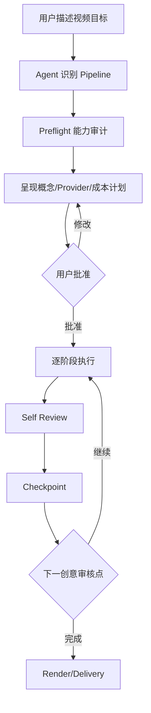
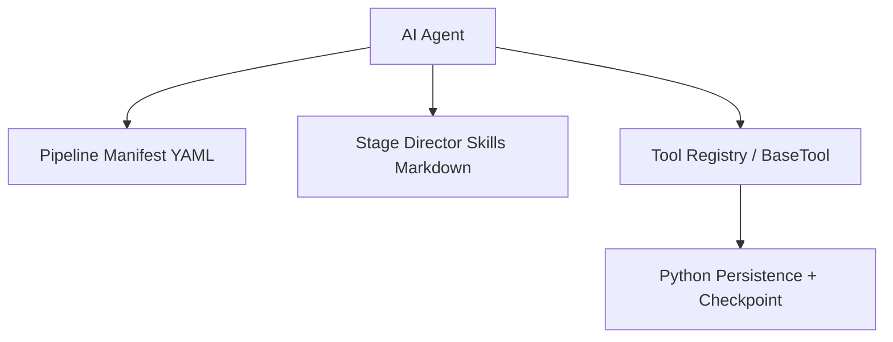
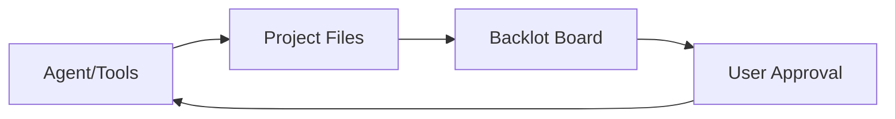
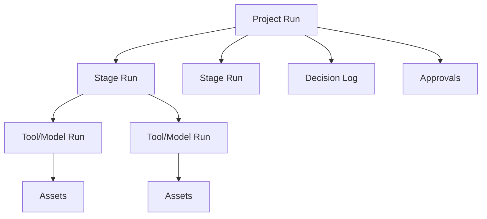

# OpenMontage 调研

> 调研日期：2026-09-06  
> 调研方式：官方 GitHub README、Agent Guide、Provider 与 Backlot 文档审阅  
> 实际运行状态：Hands-on pending  
> License：AGPL-3.0

## 1. 结论摘要

OpenMontage 是一个开源、Agent 驱动的视频生产系统。它把研究、方案、脚本、场景规划、素材生成/检索、编辑和合成组织为可恢复、可审核的生产 Pipeline，覆盖完整视频生产过程。


对我们的最大价值有五点：

1. 证明“多模态生成平台”之后还需要 production/composition layer；
2. Pipeline Manifest、Stage Director Skill、Tool Registry 三层分离值得研究；
3. Backlot 展示了一种区别于 DAG Canvas 的 live production board；
4. append-only decision log、checkpoint 和 human approval gate 很适合昂贵媒体生成；
5. Provider 选择同时考虑能力、成本、质量和可用性，而不是只匹配模型名。

**Our inference：** OpenMontage 适合作为视频生产 Workflow、Agent Skill 和审核机制的主要参考，也可能成为未来 Provider/Workflow 互操作对象；不适合作为通用多模态平台内核，因为它的核心依赖“编码 Agent 读取仓库文件并执行工具”，领域聚焦视频，且 AGPL-3.0 对代码复用需要单独审查。

## 2. 产品定位

- 项目地址：[calesthio/OpenMontage](https://github.com/calesthio/OpenMontage)
- 官方定位：开源、Agentic video production system。
- 默认交互入口：Claude Code、Cursor、Copilot、Windsurf、Codex 等能够读取文件并执行命令的编码 Agent。
- 目标结果：完整可交付视频，不只是单个生成片段。
- 主要能力：研究、脚本、AI/库存素材、TTS、音乐、字幕、编辑、合成、质量检查。
- 本地 UI：Backlot living storyboard；另有 Remotion Composer、HyperFrames 等渲染层。

**Verified from source：** 项目要求 Python 3.10+、FFmpeg、Node.js 18+ 和编码 Agent；可选接入多个图片、视频、语音、音乐和素材 Provider。

**Verified from source：** 没有 API Key 也可以使用 Piper TTS、开放素材源、Remotion/HyperFrames 与 FFmpeg 生成部分类型的视频；本地 GPU 可以启用本地视频模型。

## 3. 核心用户旅程

### 3.1 从自然语言目标开始



**Verified from source：** 每个视频生产请求必须先选择 `pipeline_defs/` 中的 Pipeline，读取 Manifest，运行 Preflight，再逐阶段读取对应 Director Skill。

### 3.2 从参考视频开始

OpenMontage 把“做一个类似这个视频的作品”和“编辑这段原始素材”作为不同的一等任务：

- reference-driven：分析 transcript、pacing、scene、keyframe 和 style，再提出差异化创意；
- source-footage：进入素材审查及 footage-led pipeline。

**Our inference：** 对我们的平台，输入媒体的语义角色不能只有 `video` 类型，还需要 `reference`、`source footage`、`first frame`、`style reference` 等 role。

## 4. Agent 驱动架构

官方 Agent Guide 对系统边界给出了非常明确的描述：



### 职责划分

- YAML Manifest：流程阶段、所需工具、fallback 和 quality gate；
- Director Skill：告诉 Agent 每个阶段应该如何做；
- Tool：提供生成、分析、编辑、渲染等具体能力；
- Python：工具实现、状态持久化和 checkpoint；
- Agent：选择、创意决策、编排、沟通、review。

**Verified from source：** 官方明确将创意决策和 orchestration 放在 Agent + instructions 中，而不是 Python orchestration code 中。

**Our inference：** 这种设计扩展快、非常适合编码 Agent，但执行确定性、版本兼容、并发和可观测性更依赖 prompt/skill discipline。我们的平台可以借鉴分层，但生产执行应有显式 Workflow IR 和服务器状态机，不能只依赖 Agent 遵守 Markdown。

## 5. Pipeline 与 Workflow

官方列出的 Pipeline 覆盖：

- Animated Explainer
- Animation
- Avatar Spokesperson
- Cinematic
- Clip Factory
- Documentary Montage
- Hybrid
- Localization & Dub
- Podcast Repurpose
- Screen Demo
- Talking Head
- Character Animation

Pipeline 共同阶段为：

```text
research → proposal → script → scene_plan → assets → edit → compose
```

不同 Pipeline 的阶段 Director Skill 和工具组合不同。

### 值得借鉴

- Pipeline 是面向用户目标的高层模板，而不是裸节点集合；
- 每阶段有稳定产物 Schema；
- Pipeline 可以声明 required/fallback tools；
- 每阶段可以检查、恢复和审核；
- Pipeline 有 production/beta/test 稳定性标签。

### 不宜直接照搬

- 所有流程强制线性阶段可能限制通用 DAG；
- Agent 运行时阅读大量 Skill 会增加上下文和一致性成本；
- Markdown 行为约束不能替代服务端权限、预算和状态保证；
- Pipeline 与某个代码仓库工作目录紧密绑定。

## 6. Tool Registry 与 Provider 选择

**Verified from source：** Tool Registry 可以发现工具，并生成 `support_envelope()`、`provider_menu()` 和面向用户的 `provider_menu_summary()`。

Preflight 汇总包括：

- composition runtimes；
- 每个 capability 已配置/总数；
- 可通过简单配置启用的工具；
- runtime warnings；
- Provider 安装说明和依赖。

官方要求先告诉用户当前能做什么，再提供可解锁选项，并区分环境变量、安装和 GPU/模型下载等配置复杂度。

**Our inference：** 这是 Capability Manifest 的强参考。我们的 Manifest 除输入输出 Schema 外，还应表达：

- availability 与 health；
- setup requirement；
- execution location；
- estimated cost/latency；
- quality characteristics；
- fallback eligibility；
- Provider/Model revision。

## 7. 决策、成本与人工审核

### 7.1 Decision Log

**Verified from source：** 重要生产决策必须在执行前向用户说明 exact tool、Provider、模型、选择理由以及 sample/batch；发生变更时向 append-only `decision_log` 写入新记录，而不是覆盖旧选择。

决策通过 `(category, subject)` 识别，最新记录代表当前选择，同时保留旧方案与拒绝原因。

**Our inference：** 我们应将 Decision/Approval 建模为独立资源或 Run Event，而不仅是 Chat 消息。这样才能支持审计、恢复、预算治理和 UI 展示。

### 7.2 Creative Gates

Backlot 在 scene-by-scene contact sheet 上显示 takes、prompt、单资产成本和质量分数，用户批准后才进入最终渲染。

**Our inference：** 对昂贵的视频生成，审批应该发生在：

1. 创意和 Provider/预算方案；
2. Script/Storyboard；
3. 少量 sample/hero still；
4. 完整批量素材生成；
5. 最终 compose/export。

## 8. Backlot Living Storyboard

Backlot 是本地生产看板，而不是完整编辑器。它从项目目录中已经写入的 artifact、asset、checkpoint、decision 和时间戳派生 UI。

主要特点：

- 展示所有本地项目；
- 生产阶段随运行进展点亮；
- 展示 screenplay、scene cards、素材、Provider 选择和成本；
- 展示等待用户处理的 creative gate；
- 支持完成后按时间戳 replay run；
- Board 是 observer，启动失败不阻塞 Pipeline。



**Our inference：** 这比传统 DAG 更适合创作者理解“现在做到哪了”。我们的 UI 可以同时有两种视图：

- Production Board：默认，面向进度、资产和审批；
- Workflow Graph：高级，面向节点、依赖和参数。

## 9. Project 与 Asset 约定

每次生产在本地创建结构化工作区：

```text
projects/<project-id>/
├── project.json
├── artifacts/
├── assets/
│   ├── images/
│   ├── video/
│   ├── audio/
│   ├── music/
│   └── subtitles.srt
└── renders/
    └── final.mp4
```

**Verified from source：** 工具必须把产物写到项目目录的明确路径；写在根目录或临时目录中的文件对 Backlot 不可见，并违反 workspace contract。

**Our inference：** 这是 local-first POC 的好设计，但长期多用户平台需要数据库元数据、对象存储、权限、checksum、lineage 和 retention。值得保留“文件是可检查事实，Board 由事实派生”的理念。

## 10. Composition Layer

OpenMontage 将生成素材与最终视频制作明确分开，支持：

- FFmpeg：裁剪、拼接、字幕、音频混合、编码；
- Remotion：React 驱动的数据型动画、字幕、图表和场景；
- HyperFrames：HTML/CSS/GSAP 驱动的 motion graphics；
- templated 与 atelier 两种 authoring mode。

**Our inference：** 这是对当前方案的重要补充：即使 vLLM-Omni 能生成视频和音频，完整平台仍需要 `compose.render`、`audio.mix`、`subtitle.burn`、`video.concat/edit` 等非模型节点。Provider SDK 不应只等同于模型 Provider，还需要 Tool/Processor Provider。

## 11. Run、Checkpoint 与恢复

**Verified from source：** Agent 通过 `checkpoint.get_next_stage()` 确定恢复位置；项目目录保存每阶段 artifact 和 checkpoint；Backlot 根据时间戳回放生产过程。

**Our inference：** 我们的 Unified Run 应形成层级：



单模型生成 Run 只是完整 Production Run 的叶子节点。

## 12. 许可证与复用

**Verified from source：** 项目许可证为 AGPL-3.0。

**Our inference：** 可以自由研究其架构和交互思想；如果复制、修改或将其服务端代码整合进网络服务，需要专门评估 AGPL 的源码开放义务。当前更适合借鉴设计和协议思想，而不是直接复制实现。此处不是法律意见。

## 13. 对我们平台的影响

### 建议新增或加强

1. Production Pipeline Template，高于低层 DAG；
2. Production Board，区别于 Workflow Graph；
3. Decision Log 与 Approval Gate；
4. Provider capability audit 与 cost preview；
5. Project Run → Stage Run → Model/Tool Run 层级；
6. 非生成模型 Tool/Processor Provider；
7. Composition 与 delivery 作为一等阶段；
8. reference media role；
9. Artifact Schema 与 local-first workspace POC。

### 仍坚持原方案

- 独立平台；
- vLLM-Omni 是首个旗舰 Provider，不是唯一 Provider；
- Capability-driven、Schema-driven UI；
- Asset 是一等对象；
- Workflow IR 与 Canvas document 分离；
- 执行状态由平台保证，Agent 不作为唯一状态机。

## 14. 与 MiniMax Design、ComfyUI 的关系

| 项目 | 最强参考点 |
|---|---|
| MiniMax Design | 商业创作者的 Agent-first 产品体验 |
| ComfyUI | Typed DAG、节点生态、缓存和局部执行 |
| OpenMontage | 开放 Agent 视频生产 Pipeline、审核、成本、最终合成 |

OpenMontage 位于两者之间：比 MiniMax Design 更开放和可检查，比 ComfyUI 更强调创意生产流程与最终交付。

## 15. 推荐亲自体验的功能

1. 零 API Key 运行一个 30–60 秒 Animated Explainer；
2. `python scripts/backlot_simulate_run.py` 体验 Backlot；
3. 从参考视频开始，观察 reference analysis 与 source-footage 的区别；
4. 查看 Preflight capability menu 和 Provider cost plan；
5. 在 Storyboard/Contact Sheet Gate 拒绝一个 Scene；
6. 中断后从 Checkpoint 恢复；
7. 比较 Remotion 与 HyperFrames；
8. 检查 Project 目录、Artifact、Decision Log 和 Asset lineage；
9. 故意缺少一个 Provider，观察 degraded/blocked/fallback 行为；
10. 检查一个 Pipeline Manifest、Stage Director Skill 与 Tool 实现是否真正解耦。

## 16. Open questions

- Backlot 是纯 observer 还是可以可靠写回 approval/action？
- Pipeline 是否支持真正的并行 DAG、局部重跑和节点级缓存？
- Skill/Manifest 版本如何锁定以确保可复现？
- 多 Agent 并发写同一项目的冲突如何处理？
- Provider 评分的七个维度和运行时选择算法如何实现？
- 长期任务在 Agent 会话中断后的恢复边界是什么？
- Local model Provider 是否适合替换为 vLLM-Omni Provider？
- AGPL 许可证对未来集成边界的具体影响是什么？

## 17. 初步判断

OpenMontage 不改变我们建设独立平台的方向，反而强化了这一方向：推理 Provider 只是创作平台的一层，完整产品还需要 Production Pipeline、Asset、Decision、Approval、Composition 和 Delivery。

它应该加入 P0 研究对象，并在 Unified Playground 之后成为 Workflow/Agent 阶段的重要设计参考。第一阶段不应完整复制 OpenMontage 的视频生产系统，但应该保证 Run、Asset 和 Provider 抽象能够支撑未来类似 Pipeline。

## 18. 主要来源

- [OpenMontage GitHub](https://github.com/calesthio/OpenMontage)
- [Agent Guide](https://github.com/calesthio/OpenMontage/blob/main/AGENT_GUIDE.md)
- [Providers](https://github.com/calesthio/OpenMontage/blob/main/docs/PROVIDERS.md)
- [Backlot](https://github.com/calesthio/OpenMontage/blob/main/backlot/README.md)
