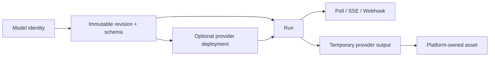

# Replicate 调研

> 调研日期：2026-09-06  
> 调研范围：Replicate 官方文档与 HTTP API；未登录运行付费模型。  
> 证据标签：`Verified from source` / `Official claim` / `Our inference` / `Open question` / `Hands-on pending`

## 1. 定位与结论摘要

Replicate 是围绕可版本化模型、统一 Prediction 生命周期和生产 Deployment 建立的托管模型平台。它将“模型是什么”“某个不可变版本是什么”“一次运行是什么”“如何给生产流量保留容量”拆成清晰资源。

- **Verified from source**：官方 API 将 Model、Version、Prediction、Deployment 分成独立资源；模型最新版本公开 OpenAPI 输入/输出 schema。
- **Our inference**：Replicate 对我们的最大价值是资源边界和稳定运行对象，而不是 workflow 画布。它为 `Model Definition → Version → Deployment → Prediction` 提供了非常清楚的参照。

## 2. 用户与核心旅程

主要用户是希望通过 API 使用公开模型的应用开发者，以及用 Cog 发布自有模型、做版本管理和生产部署的模型开发者/团队。

典型旅程：搜索模型 → 查看示例和 Playground → 修改 schema 生成的输入 → 运行 prediction → 查看状态、日志、输出与耗时 → 复制代码；生产路径则选定 version → 创建 deployment → 配置硬件和 min/max instances → 监控 predictions。

- **Official claim**：模型页第一屏是带预填示例的 Playground，帮助用户快速理解模型。
- **Hands-on pending**：跨图像/视频/音频模型的搜索、比较、表单一致性和运行历史体验。

## 3. Model 与 Version

Model 是有 owner/name、可见性、说明、示例和 latest version 的长期逻辑对象；Version 是代码、依赖、权重和 API schema 的具体发布快照。

- **Verified from source**：官方说明训练、代码或依赖变化发布为新 Version，旧版本继续可寻址，以保障可复现性。
- **Verified from source**：community model 调用通常指定 version；官方模型可用模型 endpoint 调用。
- **Verified from source**：Version 删除受约束，例如只能删除自有 private version，且被他人运行、被训练依赖或关联 deployment 时不能删除。
- **Our inference**：我们应区分“模型身份”和“可执行修订”，工作流发布时 pin revision；`latest` 只适合交互探索，不适合可复现生产流程。

## 4. OpenAPI Schema 与 Playground

每个 Replicate 模型都有 OpenAPI schema；`models.get` 可取得 latest version 的 Input/Output schema。字段包括 type、title、description、default、range 以及 `x-order` 等 UI 信息。

- **Verified from source**：官方 API 示例从 `latest_version.openapi_schema.components.schemas.Input` 读取字段；Playground 和 API 文档显示输入 description。
- **Verified from source**：模型作者在 Cog/Python 输入定义中提供 default、ge/le、description 等，模型页据此呈现表单，并可用 example prediction 预填输入输出。
- **Our inference**：Schema-driven UI 的关键不仅是控件生成，优质默认值、示例与自然语言描述直接决定首次成功体验。我们的 Capability Manifest 应允许 example、presets、advanced grouping 和 media role。
- **Open question**：复杂 union、动态依赖字段、一次多模态多输出在网页表单的具体呈现规则。

## 5. Prediction 生命周期

每次运行模型会创建 Prediction，包含 id、model、version、input、output、logs、error、status、timestamps、metrics 和操作 URL。

状态：`starting → processing → succeeded | failed | canceled`。

- **Verified from source**：starting 可能包含 worker 冷启动；processing 表示模型 predict 正在运行；成功时 output 可为对象/列表/文件 URL，失败时 error 有错误信息。
- **Verified from source**：默认是异步调用；可轮询 `urls.get`。`Prefer: wait=n` 提供最长 60 秒的同步等待，超时仍返回未完成 Prediction，之后继续异步获取。
- **Verified from source**：`Cancel-After` 可设 deadline；运行中的 prediction 也有 cancel endpoint。
- **Our inference**：Prediction 是很适合统一 Run 的基础样本：请求本身先持久化，sync 只是等待策略而非另一套业务对象。

## 6. Streaming 与取消

- **Verified from source**：支持 streaming 的模型会在 prediction `urls` 中返回 `stream` URL，可通过 SSE/EventSource 消费；流事件包含新 output 等。
- **Verified from source**：取消使用 `POST /v1/predictions/{id}/cancel`，只能由创建者取消运行中的任务，终态为 `canceled`。
- **Our inference**：流式能力属于 Version/endpoint capability，不应由 UI 猜测；统一事件需要 sequence、output name、modality、final 标识，才能同时容纳 token、audio chunk 和 video preview。
- **Hands-on pending**：取消的响应速度、取消后 partial outputs 是否保留、SSE 断线重连以及流与最终 output 的一致性。

## 7. 文件输出与留存

- **Verified from source**：HTTP Prediction 成功输出中的文件表示为 HTTPS URL；Python SDK 的 `FileOutput` 可读取/异步读取并暴露 URL，JS 对象基于 Response。
- **Verified from source**：通过 API 创建的 prediction，其输入、输出与文件默认会在一小时后自动删除；官方建议通过 webhook 及时持久化。（保留策略可能变化，接入时需再核验。）
- **Our inference**：这是平台必须拥有 Asset Ingestion 的直接证据。Run 成功不能等同于资产已安全保存；需有 `output_ready → asset_ingested` 独立步骤及失败补偿。
- **Open question**：不同账户/部署计划的文件保留、认证下载和大视频传输限制。

## 8. Webhook

创建 Prediction 时可指定 HTTPS webhook 和 `webhook_events_filter`：`start`、`output`、`logs`、`completed`；completed 覆盖 succeeded/canceled/failed。

- **Verified from source**：Webhook body 与 get Prediction API 返回对象同结构；output/log 事件会节流；网络失败会重试，因此接收端必须幂等；Replicate 不跟随 redirect。
- **Verified from source**：官方提供 default webhook signing secret API，接入应验证签名。
- **Our inference**：事件与资源快照同构简化集成，但状态事件可能乱序或重复；我们的适配器应以 prediction id + 状态单调性 + event id/内容指纹去重。
- **Hands-on pending**：实际重试次数/退避、事件排序、签名轮换和大 payload 行为。

## 9. Deployment

Deployment 是面向生产的私有专用 endpoint，将特定 model version 与硬件、min/max instances 绑定；更新形成新的 release number。

- **Verified from source**：API 可 create/get/list/update/delete deployment；配置包含 hardware、min_instances、max_instances 与 version。
- **Verified from source**：更新硬件、伸缩或 version 会增加 current release number；prediction 可直接发往 deployment。
- **Official claim**：Deployment 提供 autoscaling/scale-to-zero、always-on、滚动更新、canary、rollback、指标、GPU 内存/成本/日志和企业安全。
- **Our inference**：API 已核验的是配置与 release；零停机、canary、rollback 的详细语义需在实际控制台/文档进一步验证，不应仅据营销页写入我们的承诺。
- **Our inference**：Provider-neutral 平台应把 Deployment 抽象为可选能力，因为外部 API Provider 可能没有部署控制权限。

## 10. Workflow、资产与平台能力边界

- **Our inference**：Replicate 的核心抽象是单模型 Prediction，而非用户可编辑 DAG。可用 webhook 将一个 Prediction 输出传给另一个，但编排、节点缓存、人审与局部重跑应由上层系统处理。
- **Our inference**：Model/Version/Deployment/Prediction 的正交关系非常适合我们的 Registry 与 Run，但 vLLM-Omni 多 stage 是单一模型内部执行细节，不应误建模为多个 Replicate-style Models。
- **Open question**：团队/RBAC、审计、配额与组织范围 API 的具体能力及套餐差异。

## 11. 优点、局限与可复用性

### 值得借鉴

- Model 与不可变 Version 分离。
- Prediction 作为异步、同步等待、stream、webhook 的统一真相对象。
- 输入输出 OpenAPI schema 驱动 Playground 与文档。
- Deployment 将 version、硬件、容量配置绑定，并形成 release。
- 示例 Prediction 同时承担教学、默认输入和模型展示。

### 不建议照搬

- 用临时外部 URL 作为平台长期资产。
- 把 Model `latest_version` 直接写进已发布 workflow。
- 假设所有 Provider 都能控制 deployment/hardware。
- 将 workflow 简化为 webhook 串接而缺少节点级状态。

### 集成判断

- **Our inference**：Replicate Provider 容易映射：Model/Version → Capability Registry revision，Prediction → Run，Webhook/SSE → Run Events，FileOutput → Asset ingestion；Deployment 管理由 Provider extension 单独暴露。

## 12. 建议的亲自体验任务

1. 各选一个图像、视频、音频模型，比较 schema 表单、默认 example、多输出播放器。
2. 对长视频 Prediction 测试异步 polling、`Prefer: wait` 超时转异步、SSE 和 cancel。
3. 注册 webhook 订阅 start/output/logs/completed，制造重复投递并验证幂等。
4. 下载媒体后等待/观察 URL 生命周期，确认资产持久化责任。
5. 查看同一 Model 多 Version，固定旧版运行并比较 latest 更新后的复现性。
6. 创建测试 Deployment，调整 min/max/hardware/version，观察 release、冷启动、指标和成本预估。
7. 制造 schema validation 与 runtime error，评估错误对普通用户是否可理解。

重点评分：模型发现、首次成功、schema 表单、版本可复现、长任务透明度、文件留存、部署控制与费用可理解性。

## 13. 对 vLLM-Omni UX Platform 的设计影响

建议用这一资源链作为 Registry/Run 的基线，同时增加 Workflow/NodeRun、原生多输出和 vLLM-Omni stage telemetry。

## 14. 来源

- [Predictions](https://replicate.com/docs/topics/predictions)
- [Create a prediction](https://replicate.com/docs/topics/predictions/create-a-prediction)
- [Streaming output](https://replicate.com/docs/topics/predictions/streaming)
- [Webhooks](https://replicate.com/docs/topics/webhooks)
- [OpenAPI model schemas](https://replicate.com/docs/reference/openapi/)
- [Model versions](https://replicate.com/docs/topics/models/versions)
- [Publish a model / Playground](https://replicate.com/docs/topics/models/publish-a-model/)
- [Deployments](https://replicate.com/docs/topics/deployments/)
- [HTTP API](https://replicate.com/docs/reference/http)
