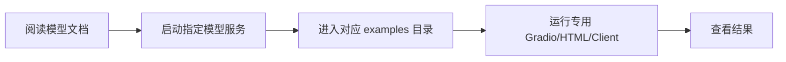
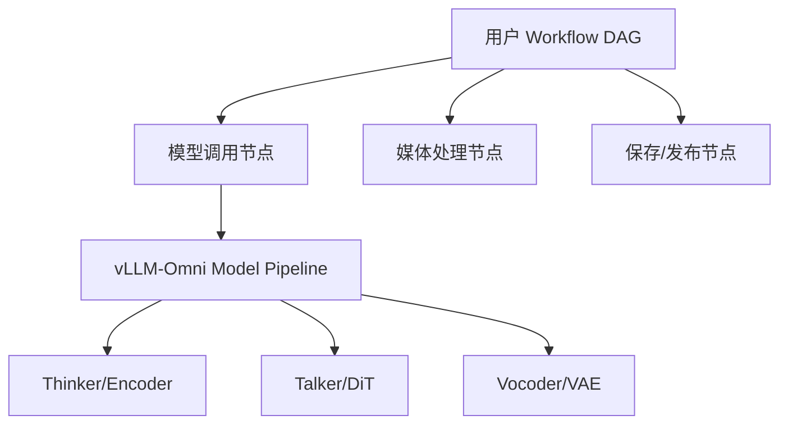

# vLLM-Omni Existing UX Research

> Research status: Source reviewed; hands-on testing pending  
> Last reviewed: 2026-09-06  
> Scope: vLLM-Omni repository `apps/`, `examples/`, serving documentation and runtime architecture

## 1. Executive summary

**Verified from source:** vLLM-Omni 已经拥有覆盖多模态聊天、图片、视频、TTS、实时语音和 ComfyUI 的大量交互样例，但没有统一的产品入口、模型能力描述、Run 历史和 Asset 管理。现状更像一套按模型或 API 演进的 UX reference implementations。

**Our inference:** 建设统一平台时不应重写所有媒体交互。现有 Gradio、AudioWorklet、MSE/fMP4 播放器、实时 WebSocket 客户端和 ComfyUI 节点可以成为组件与协议参考；平台层则需要新增 Capability、Provider、Run、Asset 和 Project 抽象。

## 2. 产品定位与目标用户

vLLM-Omni 本身定位为 omni-modality 模型推理与服务框架，UX 主要服务于：

- 模型开发者验证新模型；
- API 开发者验证 serving path；
- 用户快速体验特定模型；
- 性能和流式能力演示；
- ComfyUI 用户调用本地或远程 vLLM-Omni 服务。

**Verified from source:** 前端大多位于 `examples/`，ComfyUI 扩展位于 `apps/`；这表明它们当前主要是示例或集成，不是统一产品控制台。

## 3. 现有前端清单

### 3.1 多模态对话

| 前端 | 形态 | 输入 | 输出 |
|---|---|---|---|
| Qwen2.5-Omni | Gradio + OpenAI-compatible API | text/image/audio/video | text/audio |
| Qwen3-Omni | Gradio + OpenAI-compatible API | text/image/audio/video | text/audio |
| MiniCPM-o 4.5 | Gradio + OpenAI-compatible API | text/image/audio/video | text/audio |
| AURA Omni | Gradio + multi-stage service | audio/video + configuration | text/audio |

### 3.2 图片

- 在线 Text-to-Image Gradio；
- 在线 Image-to-Image/Image Edit Gradio；
- 离线 Text-to-Image Gradio，直接实例化 `Omni`；
- Lance 统一 Gradio，覆盖图片生成、编辑与理解。

### 3.3 视频

- `/v1/realtime/video` Gradio；
- 自定义 HTML/JavaScript MSE Player，用于播放 fMP4/M4S 流；
- 默认提供 Helios-Distilled 参数预设；
- Lance 统一 Gradio覆盖视频生成、编辑、理解与图生视频。

### 3.4 TTS

- Qwen3-TTS：CustomVoice、VoiceDesign、Base/voice cloning；
- Qwen3-TTS word timestamps：逐词时间戳、高亮和 barge-in 演示；
- VoxCPM2：AudioWorklet 无缝流式播放；
- MOSS-TTS-Nano：48 kHz stereo 流式播放；
- Fish Speech S2 Pro：合成、克隆、流式与非流式；
- GLM-TTS：参考音频克隆；
- Voxtral TTS：专用 Gradio 客户端。

### 3.5 实时语音

- PersonaPlex compatibility server 在 `/` 托管从模型仓库获取的官方 Web Client，通过 `/api/chat` 进行双工音频交互；
- MiniCPM-o 原生 HTML/JS 客户端通过同源 FastAPI WebSocket proxy 使用 `/v1/realtime?duplex=1`；
- MiniCPM-o 也有普通上传式 Gradio，与实时客户端形成两种交互路径。

### 3.6 ComfyUI

ComfyUI 扩展提供：

- Generate Image；
- Generate Video；
- Multimodality Understanding；
- TTS 与 TTS Voice Clone；
- AR/Diffusion/Multi-stage sampling parameter nodes；
- 示例工作流与服务串联。

## 4. 用户旅程

典型路径通常从寻找模型对应的示例开始：

**Verified from source:** 多个模型提供 `run_gradio_demo.sh` 同时启动 Server 与 Gradio，降低单模型体验成本。

**Our inference:** 对开发者而言这很直接；对希望探索模型或完成跨模型任务的用户而言，必须先知道模型、服务命令、端口和对应 Demo，发现成本较高。

## 5. API 与任务模型

### 5.1 已有公共接口

| 能力 | 接口/协议 | 任务形态 |
|---|---|---|
| Chat/Omni | `/v1/chat/completions` | 同步或流式 |
| 图片生成 | `/v1/images/generations` | 同步，多图片 |
| 图片编辑 | `/v1/images/edits` | 同步；部分多阶段模型支持 SSE |
| 视频生成 | `/v1/videos` | 异步 Job |
| 视频基准路径 | `/v1/videos/sync` | 同步 |
| 通用音频生成 | `/v1/audio/generate` | 同步 |
| TTS | `/v1/audio/speech` | 同步、raw stream 或 SSE |
| 流式文本输入 TTS | `/v1/audio/speech/stream` | WebSocket |
| 视频流理解 | `/v1/video/chat/stream` | WebSocket |
| 实时/双工 | `/v1/realtime` 等 | WebSocket |

**Verified from source:** 不同模态已经出现多种生命周期：直接响应、SSE、裸字节流、WebSocket 和异步视频 Job。

**Our inference:** 统一平台必须在 Provider Adapter 上方提供自己的 Run/Event 规范，不能让前端分别绑定每个底层协议。

### 5.2 参数差异

API 同时包含 OpenAI-style 字段和 vLLM-Omni 扩展字段。图片、视频、TTS 和 Omni 多阶段模型的参数差异显著。

**Our inference:** 应统一常见任务概念，但保留 `provider_options.vllm_omni`，避免最低公分母抽象丢失多阶段采样、diffusion streaming 等能力。

## 6. Streaming 与媒体组件

### 可复用资产

1. Qwen3-TTS/VoxCPM2/MOSS-TTS 的 AudioWorklet gapless playback；
2. Qwen3-TTS word timestamp 可视化与 barge-in Demo；
3. Helios streaming video 的 MSE/fMP4/M4S Player；
4. MiniCPM-o Realtime 浏览器音频采集、播放与 WebSocket proxy；
5. PersonaPlex official-client protocol compatibility；
6. Gradio 中的多媒体编码、base64、上传与预览辅助函数。

**Open question:** 这些组件的代码边界、浏览器兼容性、许可证归属和抽取成本需要逐一审计。

## 7. Capability 与 Schema-driven UI

**Verified from source:** 当前各 Gradio 页面主要针对已知模型和接口显式构建控件。ComfyUI 节点按输出模态与 API 设计，文档明确其能力不能超过 online serving interface。

**Our inference:** 当前尚未看到一个服务端通用 Capability Manifest，能够完整表达：

- input/output modalities；
- task taxonomy；
- parameter JSON Schema；
- streaming protocols；
- native multi-output；
- model/stage-specific options；
- hardware/deployment requirements。

这应成为 Unified Playground POC 的第一项核心抽象。

## 8. Run、Asset 与 Project

### Run

**Verified from source:** 视频 API 已有异步 Job 和存储路径；其他接口通常直接返回结果或建立流式连接。

**Our inference:** 尚未形成跨模态统一、持久化的 Run 资源，缺少统一的查询、取消、重试、历史和父子步骤关系。

### Asset

**Verified from source:** 输出可能是 base64、HTTP content、WAV/PCM stream、视频文件或 Python 对象。异步视频提供服务端文件存储配置。

**Our inference:** 尚未形成跨模态 Asset Registry；输入、中间结果和最终结果不能在所有 Demo 中统一复用。

### Project

**Our inference:** examples 不提供统一的用户 Project、Workspace、会话、权限或共享语义。这些属于外部平台层，不应直接加入核心 inference runtime。

## 9. Workflow 与插件

vLLM-Omni 内部 Pipeline 描述一个模型内部的多 Stage 执行；ComfyUI Workflow 描述用户级的多节点任务。二者不应混为一层。

**Verified from source:** ComfyUI-vLLM-Omni 已证明用户工作流可以通过远程 API 调用 vLLM-Omni。

**Our inference:** 独立平台应拥有 Workflow IR，并通过 Provider 调用模型；不应把用户 DAG 编译成内部 `PipelineConfig`。

## 10. 优点

- 模态覆盖完整；
- 已积累大量真实模型交互；
- 流式文本、音频、视频和双工路径丰富；
- OpenAI-compatible 接口降低基础接入成本；
- ComfyUI 集成验证远程节点工作流；
- Gradio Demo 对模型开发与回归验证友好；
- 底层 Runtime 已具备阶段级指标和多 Stage 能力。

## 11. 局限

- 前端入口分散；
- 多个页面重复实现输入、编码、媒体播放和 API 请求；
- 模型/任务能力多数由具体 Demo 预知；
- 缺少统一 Run、Asset、Project 和 Workflow；
- 错误、取消、重试和历史体验不一致；
- 没有跨服务的模型目录与健康状态入口；
- 面向模型开发的参数暴露不一定适合内容创作者。

## 12. 对统一平台的启示

### 建议复用

- OpenAI-compatible API client patterns；
- AudioWorklet、MSE Player 和 realtime WebSocket 交互；
- ComfyUI 节点任务分类；
- 现有示例作为 Provider conformance tests；
- `/v1/models`、voices、metrics 和健康检查作为能力发现的输入。

### 不建议照搬

- 每个模型建立一个独立页面；
- 前端直接理解内部 Stage 类型；
- 将大文件长期保存在 base64 JSON 中；
- 将底层 API 生命周期原样暴露给平台 UI；
- 把统一平台主体放入推理核心仓库。

### 需要原型验证

1. 是否能为四类代表模型编写同一 Capability Manifest；
2. 是否能把 REST/SSE/raw stream/WebSocket/video Job 归一为一个 Run/Event 接口；
3. 现有媒体组件能否从 Gradio Demo 中抽取到现代 Web 前端；
4. native multi-output 如何与 workflow multi-node output 共用 Asset 模型；
5. 服务端是否应原生暴露 capability metadata。

## 13. 推荐的参考模型集

| 模型/服务 | 验证目的 |
|---|---|
| Qwen3-Omni 或 MiniCPM-o | 多模态输入、文本+音频多输出 |
| Qwen-Image/Edit | 图片生成与编辑 |
| Helios 或 Wan | 异步/流式视频 |
| Qwen3-TTS | TTS、voice modes、AudioWorklet |
| MiniMax H3 | 原生视频+音频联合输出 |

## 14. Hands-on pending

- 实际启动代表性 Gradio Demo，记录首次成功时间；
- 对比四种 API 的错误、取消和重试；
- 使用同一素材完成图片理解、图片生成、视频生成和 TTS；
- 测量跨 Demo 重复配置量；
- 验证 ComfyUI Chaining Services 工作流；
- 检查浏览器媒体组件在主流浏览器中的行为。

## 15. 初步结论

vLLM-Omni 已经具备统一多模态平台最难获得的底层能力和大量交互参考，但缺少平台级资源模型与统一入口。最合理路径是建立独立 UX Platform 和 vLLM-Omni Provider：先通过 Unified Playground 抽取共性，再决定是否引入 Agent 和 Workflow Canvas。
