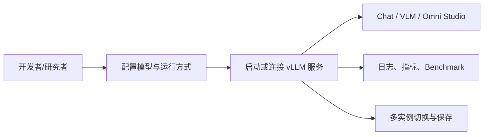
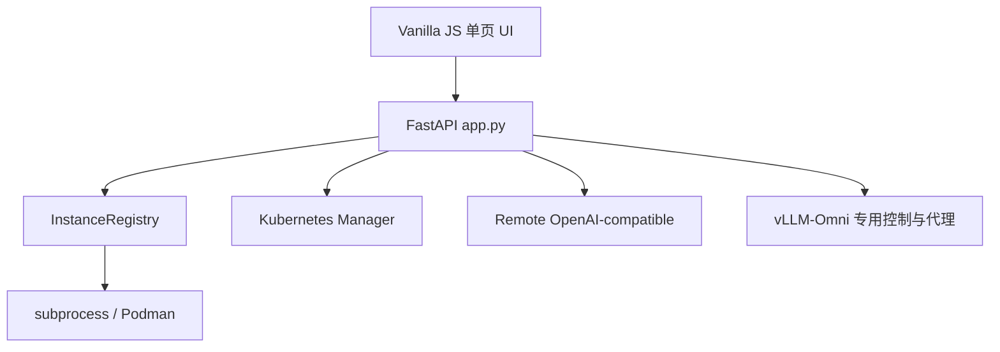
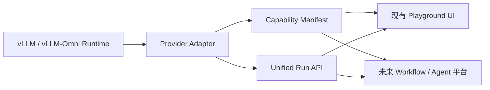

# vLLM Playground 竞品调研

> 项目：[`micytao/vllm-playground`](https://github.com/micytao/vllm-playground)  
> 调研日期：2026-09-06  
> 源码基线：commit `76276229092455f9ef66748731e4a615f4d80720`（仓库提交日期 2026-04-08），tag `v0.1.8`  
> 调研方式：README、发布说明、架构/多实例/vLLM-Omni 文档及核心前后端源码静态检查  
> 实际运行状态：**Hands-on pending**（未配置 GPU、模型和服务端执行完整生成流程）

## 0. 结论摘要

vLLM Playground 是一个 Apache-2.0 开源的、以开发者为核心用户的 **vLLM 服务启动/连接、交互和观测控制台**。它已把普通 vLLM Chat、多实例管理、远程 OpenAI-compatible 服务、VLM、MCP、Benchmark、指标观测和 vLLM-Omni Studio 放进同一个 Web 应用。

它是当前最接近我们出发点的开源项目，值得优先联系作者和讨论合作；但按现有代码，它还不是可直接承载“开放多模态 UX Platform”的平台内核：

- 主 vLLM 已有 subprocess/container/remote 多实例 Registry；vLLM-Omni 仍由一组全局变量管理，实质上是单实例。
- 多模态 UI、模型列表、参数面板和 endpoint 路由大量按 `image/video/tts/audio/omni` 分支硬编码，没有 Capability Manifest 或 Provider SDK。
- 图片、视频、音频生成是同步请求，缺少统一 Run ID、任务队列、取消、重试、持久化状态和媒体流式事件。
- “统一 Gallery”是浏览器当前 DOM 内的 base64/blob 展示，不是持久化 Asset 模型；刷新后不可作为素材库恢复。
- 代码整体是大型 FastAPI `app.py` + Vanilla JS 单页应用，原型迭代快，但模块边界、自动化测试和多人维护基础仍偏早期。

建议定位：**优先作为潜在合作对象和 POC 基础候选，而不是不加改造地作为长期平台内核。** 最合理的合作切入点是共同抽取 `Capability Manifest + vLLM/vLLM-Omni Provider Adapter + Unified Run`，并让现有 Studio 成为第一个消费这些契约的 UI。

---

## 1. 基本信息与产品定位

### 1.1 基本信息

- **Verified from source**：项目 `pyproject.toml` 将其描述为 “A web interface for managing and interacting with vLLM servers”，目标用户 classifier 包括 Developers 和 Science/Research。
- **Verified from source**：Python 3.9+；后端 FastAPI/Uvicorn，前端原生 HTML/CSS/JavaScript；核心依赖还包括 aiohttp、websockets、Pydantic、psutil、requests。
- **Verified from source**：许可证为 Apache License 2.0，允许修改、分发和商业使用，需保留许可证/NOTICE 等义务。
- **Verified from source**：项目可通过 PyPI 安装，提供 `vllm-playground` CLI；仓库状态标为 Beta。
- **Official claim**：支持 GPU/CPU、macOS Apple Silicon、OpenShift/Kubernetes、多个 vLLM 实例、远程服务、vLLM-Omni、多模态 VLM、MCP、Claude Code、Benchmark 和 Observability。

### 1.2 实际产品定位

**Our inference**：它首先是“推理服务管理控制台”，其次是“模型 Playground”，而不是以内容生产为中心的设计平台。用户的核心对象是模型服务 Instance，而不是 Project、Asset、Workflow 或 Creative Brief。

### 1.3 与我们方向的交集和差异

| 方面 | vLLM Playground 当前重心 | 我们拟议的平台重心 |
|---|---|---|
| 首要对象 | 推理 Instance、模型配置 | Capability、Run、Asset、Workflow |
| 默认旅程 | 启动/连接服务后交互 | 从任务/创作目标开始，自动选择 Provider |
| 多模态 | 分模态 Studio | 统一、可组合、多输出的交互与工作流 |
| 扩展后端 | 远程 OpenAI-compatible + vLLM-Omni 专用路径 | Provider SDK，允许多框架 |
| 用户体系 | 本地单用户工具倾向 | 可演进至项目、多用户、权限和配额 |

---

## 2. 核心用户旅程

### 2.1 普通 vLLM

- **Verified from source**：用户选择 subprocess、container 或 remote，设置模型、GPU/高级参数并启动/连接服务；成功后生成一个 Instance。
- **Verified from source**：多个 Instance 以 Tab 呈现，切换时恢复该实例的配置、聊天历史、日志、Token 计数和指标。
- **Verified from source**：本地实例可启停；remote 模式连接已有 OpenAI-compatible endpoint，并从 `/v1/models` 获取模型列表。
- **Verified from source**：实例可以显式 Save；保存的配置写入 `~/.vllm-playground/instances.json`，聊天历史按实例保存在浏览器 `localStorage`。

### 2.2 vLLM-Omni Studio

- **Verified from source**：侧边栏进入独立 vLLM-Omni 页面，选择 `image`、`video`、`tts`、`audio` 或 `omni` 类型，选择模型和运行方式后启动/连接服务。
- **Verified from source**：生成类任务采用固定三段式体验：prompt/输入 → 模态专属参数 → Gallery/播放器。
- **Verified from source**：图片编辑模型会显示拖拽上传区；TTS 显示 voice/speed/instructions；音频显示 duration/steps/guidance；视频显示 resolution/duration/fps 等参数。
- **Verified from source**：Omni Chat 走专门的聊天面板，可流式转发 text/audio 内容。

### 2.3 新手体验判断

- **Our inference**：服务启动、venv、显存、并行和容器参数对模型开发者合理，对内容创作者门槛较高。
- **Our inference**：预置模型、Recipe 和 prompt template 能降低首次使用难度，但用户仍需理解“运行一个推理服务”，产品不是从创作任务出发。
- **Hands-on pending**：首次安装到生成第一张图/第一段音频的实际耗时、错误引导质量和硬件探测准确度。

---

## 3. 技术栈与架构

### 3.1 代码架构

- **Verified from source**：后端主体集中在 `vllm_playground/app.py`，文件包含服务生命周期、Chat 代理、MCP、Recipes、Metrics、Benchmark、Omni、Claude Code 等大量职责。
- **Verified from source**：普通 vLLM 的实例抽象位于 `backend_registry.py`；本地容器生命周期位于 `container_manager.py`；Kubernetes/OpenShift 有独立 manager。
- **Verified from source**：前端为单页 Vanilla JS；主逻辑集中于 `static/js/app.js`，Omni 在 `static/js/modules/omni.js`，观测、MCP 等也有若干模块。
- **Verified from source**：没有 React/Vue 等组件框架，也没有独立前端构建链路。
- **Verified from source**：仓库 `pyproject.toml` 配置了 pytest，但本次源码基线未发现 `tests/` 目录。

### 3.2 架构优点

- **Our inference**：安装简单、静态资源可直接打包进 Python wheel，适合快速分发和本地部署。
- **Our inference**：服务管理、Chat 和诊断在同一进程，POC 调试路径短。
- **Verified from source**：支持 subprocess、container、remote 三种模式，并提供硬件检测、日志 WebSocket、健康检查和配置恢复。

### 3.3 架构约束

- **Our inference**：大型 `app.py` 和共享全局状态会增加并发、多租户、分布式任务和 Provider 扩展的改造成本。
- **Our inference**：Vanilla JS + 字符串模板便于小团队快速开发，但多模态组件、Schema-driven forms、DAG Canvas 和插件隔离增长后维护难度会明显上升。
- **Verified from source**：当前未见数据库、对象存储、后台 Job Queue 或独立 Worker。

---

## 4. 多实例与服务生命周期

### 4.1 普通 vLLM 多实例

- **Verified from source**：`InstanceEntry` 保存 id、name、model、url、port、api_key、run_mode、managed、pid、container_name、gpu_devices、config、health、timestamps 和 saved 标志。
- **Verified from source**：Registry 支持 CRUD、Active Pointer、保存/取消保存、8000–8100 端口分配、健康检查和启动恢复。
- **Verified from source**：保存实例采用 JSON 文件；仅 `saved=True` 的实例持久化，进程 handle 只存在内存。
- **Verified from source**：remote 健康检查使用 `/v1/models`；本地实例使用 `/health`。
- **Verified from source**：多实例切换会先激活某个实例，再将应用级全局配置或指针重新指向它；请求本身不携带 provider/instance 参数。

### 4.2 实例隔离范围

- **Verified from source**：聊天历史、日志、Token 计数和指标按实例切换；聊天历史主要由前端内存和 `localStorage` 保存。
- **Our inference**：这是单用户浏览器场景的“体验隔离”，并非服务端强隔离或租户隔离。
- **Open question**：多浏览器用户同时切换 Active Instance 时是否互相影响。源码中的服务端 active pointer/global state 表明存在风险，需要并发实测。

### 4.3 vLLM-Omni 生命周期不对称

- **Verified from source**：Omni 使用 `omni_process`、`omni_container_id`、`omni_running`、`omni_config`、`omni_run_mode`、`omni_inprocess_model` 等模块级全局变量。
- **Verified from source**：Omni 默认端口 8091，支持 subprocess/container/remote；Stable Audio 在 subprocess 配置下会切到进程内模型模式，绕过服务端音频序列化问题。
- **Our inference**：vLLM-Omni 没有接入普通 vLLM 的 Instance Registry，因此当前一次只能管理一个 Omni 服务，无法自然支持同时运行图片、视频、TTS 多服务并组合调用。
- **Open question**：作者是否已有把 Omni 合并进 Instance Registry 的路线图；仓库现有文档未给出明确计划。

---

## 5. vLLM-Omni Studio 的真实支持范围

以下是按源码确认的 UI 和后端路径，而非仅按 README 宣传。

| 类型 | 前端/后端路径 | 返回方式 | 结论 |
|---|---|---|---|
| 文生图 | `/api/omni/generate` | 同步 JSON + base64 | **Verified from source** |
| 图像编辑 | 同一 endpoint + `input_image`，仅白名单模型允许 | 同步 JSON + base64 | **Verified from source** |
| 文生视频 | `/api/omni/generate-video` → Omni `/v1/chat/completions` | 等完整响应后提取 base64 | **Verified from source**；非流式 |
| TTS | `/api/omni/generate-tts` → `/v1/audio/speech` | 等完整音频 bytes 后 base64 | **Verified from source**；非流式 |
| 文生音频/音乐 | `/api/omni/generate-audio` | Stable Audio 进程内特殊路径或 API 路径 | **Verified from source**；存在模型特例 |
| Omni Chat | `/api/omni/chat` → `/v1/chat/completions` | SSE，解析 text/audio | **Verified from source**；仅此处有生成内容流式转发 |

### 5.1 预置模型范围

- **Verified from source**：`/api/omni/models` 返回代码内静态字典，包含多种 Qwen Image/Image Edit、Z-Image、BAGEL、Ovis、LongCat、SD3.5、FLUX.2；Qwen3-Omni；Wan2.2 T2V/TI2V/I2V；Qwen3-TTS 三种；Stable Audio。
- **Verified from source**：图片编辑能力同时由 `IMAGE_EDIT_MODELS` Python 集合识别。
- **Our inference**：文档描述“from official docs”，但服务并未从 vLLM-Omni runtime 动态发现 capability；列表会随上游变化而漂移。
- **Open question**：当前列出的每个模型与当前 vLLM-Omni release 是否实际兼容，尤其参数格式、显存估算和 I2V 输入路径，需要逐模型验证。

### 5.2 特别需要澄清的支持程度

- **Verified from source**：视频模型虽列出 TI2V/I2V，但 `VideoGenerationRequest` 和前端视频路径是否完整提供图像输入，需要 hands-on 和更细的请求路径验证；不能仅凭模型名称认定 UI 已完整支持 I2V。
- **Verified from source**：Qwen3-TTS UI 提供 voice、speed、instructions，但源码没有通用参考音频 Asset 输入抽象；“Custom Voice”模型名不等于完整 voice cloning UX 已实现。
- **Verified from source**：Omni Chat 请求模型支持 messages、temperature、max_tokens 和 stream，解析文本与 data-URL audio；未见统一支持图片/视频/麦克风输入的 capability-driven composer。
- **Official claim**：README 将产品概括为生成图片、编辑照片、语音和音乐，并列出视频/Omni。
- **Hands-on pending**：视频、Omni Chat、TTS voice modes 端到端可用性及错误恢复。

---

## 6. 模型能力与参数是否硬编码

结论：**目前显著硬编码。**

- **Verified from source**：Pydantic `OmniConfig.model_type` 固定为 `image|omni|video|tts|audio`。
- **Verified from source**：前端 `omni.js` 通过 `if/else` 按 model type 显示固定参数组，并保存大量预置 prompt templates、GPU configuration presets 和类型说明。
- **Verified from source**：模型目录由 `/api/omni/models` 内的 Python 字典维护；图片编辑模型另有白名单。
- **Verified from source**：Stable Audio 由模型名字符串包含 `stable-audio` 触发特殊的 in-process 执行和 stage config。
- **Verified from source**：不同模态分别拥有独立 endpoint 和 Response model。
- **Verified from source**：未发现 `Capability Manifest`、JSON Schema 驱动 UI、Provider base class、插件注册表或 entry point 加载机制。

**Our inference**：新增一种模态、一个原生多输出模型或一个接口不兼容的 Provider，通常需要同步修改后端 schema/endpoint、模型表、HTML 和前端分支，移植性有限。

---

## 7. Run、Streaming 与 Asset 抽象

### 7.1 Run

- **Verified from source**：图片/视频/TTS/Audio 请求等待结果完成，响应含 `success`、base64 数据、格式、generation_time 或 error；没有 `run_id`。
- **Verified from source**：没有统一 `queued/running/streaming/succeeded/failed/cancelled` 状态机。
- **Verified from source**：没有 generation job 查询、取消或重试 endpoint；停止的是整个 Omni server，不是单个任务。
- **Our inference**：长视频生成把 HTTP 连接保持最多 10 分钟，不适合生产队列、断线恢复或多人任务管理。

### 7.2 Streaming

- **Verified from source**：普通 Chat 和 Omni Chat 使用 SSE；Omni Chat 将上游 content list 映射成 `text` 或 `audio` 事件。
- **Verified from source**：服务日志通过 WebSocket 推送。
- **Verified from source**：视频、图片、TTS 和 Stable Audio 生成接口不是统一增量事件协议。
- **Our inference**：它验证了浏览器展示多模态结果和 SSE Chat 的基本可行性，但不能直接视为统一 multimodal streaming 层。

### 7.3 Asset

- **Verified from source**：Studio Gallery 用前端 DOM 创建 image/video/audio 项，支持预览、下载、删除和清空。
- **Verified from source**：生成内容以 base64/blob URL 进入页面；未发现写入后端对象存储、SQLite/数据库或可检索 Asset 元数据。
- **Verified from source**：Gallery 内容没有像聊天历史一样写入 `localStorage` 的代码路径。
- **Our inference**：Gallery 是 session 内结果展示器，不是素材中心；刷新、跨浏览器、跨用户、工作流复用和 lineage 均未解决。

---

## 8. 扩展性与平台工程

### 8.1 已有扩展能力

- **Verified from source**：Remote 模式能连接 OpenAI-compatible 服务，带 Bearer token，并从 `/v1/models` 获取模型；对 LiteLLM metadata 有兼容处理。
- **Verified from source**：Recipes 允许保存/加载 vLLM 配置；MCP 可增加模型调用的工具。
- **Verified from source**：支持 Podman/Docker、本地 subprocess、自定义 venv、OpenShift/Kubernetes 和不同硬件模式。
- **Verified from source**：Observability 聚合 Prometheus/日志/前端上报指标，并以 JSONL 保存一段历史。

### 8.2 不等同于 Provider 插件系统

- **Our inference**：Remote OpenAI-compatible 是协议兼容，不是通用 Provider SDK；vLLM-Omni 自己就是旁路式专用集成。
- **Verified from source**：未见 Provider 生命周期接口、capability negotiation、输入输出类型注册、前端 renderer 插件或隔离机制。
- **Our inference**：MCP 扩展的是 LLM 工具调用，不负责接入图片/视频/TTS 推理后端，不能替代 Provider Plugin。

### 8.3 多用户/生产化缺口

- **Verified from source**：未见登录、用户、Project、RBAC、配额或租户数据模型。
- **Verified from source**：remote API key 可写入实例 config；需要进一步审计其落盘和前端返回范围。
- **Our inference**：当前设计更适合受信任的个人或团队内网工具，不能直接暴露为公网多租户控制面；它具有启动进程、容器、MCP 和终端等高权限功能。
- **Open question**：OpenShift 部署是否有外部平台提供认证/网络隔离；项目本身未体现完整安全边界。

---

## 9. 许可证与复用可行性

- **Verified from source**：Apache-2.0。
- **Our inference**：从许可证角度，fork、二次开发、抽取组件和商业化均较友好，但需遵守版权、许可证及变更声明要求。
- **Our inference**：比法律许可更大的复用约束是代码耦合：Omni 前端依赖固定 HTML id、全局 UI 对象和专用 endpoint；直接抽成独立 npm/component package 的成本不低。
- **Open question**：项目维护者对与 vLLM-Omni 官方协作、治理权、roadmap 和品牌定位的意愿。

---

## 10. 是否适合作为基础项目或合作对象

### 10.1 评分（源码调研阶段）

| 维度 | 初评 | 理由 |
|---|---:|---|
| 与 vLLM/vLLM-Omni 起点接近度 | 5/5 | 已有服务管理和 Omni Studio |
| 快速 POC 可用性 | 4/5 | FastAPI + 原生前端，已有完整入口 |
| 多模态覆盖 | 3/5 | 多类型已有，但深度和流式不一致 |
| Provider 可移植性 | 2/5 | 模型、类型、endpoint 大量硬编码 |
| Workflow/Agent 基础 | 1/5 | 无 DAG、Run orchestration、Asset lineage |
| 生产级任务模型 | 1/5 | 无队列、Run ID、取消、断线恢复 |
| 多租户平台基础 | 1/5 | 无用户/项目/RBAC/配额 |
| 许可证友好度 | 5/5 | Apache-2.0 |
| 合作价值 | 5/5 | 方向高度相关，避免重复建设 |

### 10.2 四种路径判断

#### A. 直接作为长期平台内核

**不建议立即决定。** 需要较大重构才能容纳 Provider、Capability、Run、Asset、Workflow 和多租户；如果直接在当前分支堆功能，长期耦合风险高。

#### B. Fork 后快速做 POC

**可行。** 若目标是 2–4 周展示“统一 vLLM/vLLM-Omni Playground”，它已经省掉服务启动、模型配置、媒体预览和观测的大量工作。

#### C. 上游合作、渐进抽象

**最推荐先探索。** 先和作者确认 roadmap，再提出小而可合并的架构演进：

1. 将 Omni 纳入统一 Instance Registry；
2. 引入 Capability Manifest，替换硬编码模型表/参数分支；
3. 定义统一 Provider Adapter；
4. 定义异步 Run 和统一 Output/Asset reference；
5. 保持现有 UI 兼容，逐步迁移。

#### D. 独立建平台，仅参考/复用

**若长期目标是 MiniMax Design 式创作平台，这是风险最低的边界。** 可复用其 vLLM 服务探测、实例生命周期和部分媒体交互经验，通过 Provider 接口连接，而不是把内容平台能力全部塞回它的单体应用。

### 10.3 推荐决策门槛

在做 fork/合作/独立项目决策前，需要完成三个验证：

- 与作者沟通未来定位：控制台还是多模态创作平台；是否愿意接受 Provider/Run 层重构。
- 实际跑通 image、video、TTS、Omni Chat，记录接口兼容性和失败恢复。
- 用一个最小外部 Provider 接入实验验证：若新增 Provider 必须大面积修改 UI/后端，则应把新平台独立出来。

---

## 11. 对我们的具体启示

### 11.1 建议借鉴

- 三种服务接入模式：subprocess、container、remote。
- Instance Tab + 保存配置 + 健康状态的模型开发者体验。
- 服务日志、启动命令预览、硬件探测、Benchmark 和 Observability 的一体化体验。
- 同一 Studio 内适配图片、视频和音频的布局与播放器。
- vLLM 与 vLLM-Omni 分离端口/环境的现实兼容经验。
- Remote `/v1/models` 探测和 API key 接入。

### 11.2 不建议照搬

- 通过模型名和 model type 分支驱动能力与 UI。
- 为每种模态持续增加专用 endpoint/Response class。
- 用同步长 HTTP 请求承载视频等长任务。
- 将 base64 DOM Gallery 当作素材管理。
- 用应用级 active pointer 代表多实例请求路由。
- 在一个大型应用进程中同时承担平台 API、进程/容器编排、离线模型推理和用户请求。

### 11.3 可合作提出的最小 RFC

建议第一版接口只解决：

- `list_capabilities()`：输入/输出 modality、参数 schema、streaming 特征；
- `submit()`：返回 `run_id`；
- `events(run_id)`：统一文本 token、音频 chunk、视频 segment、progress 和 error；
- `cancel(run_id)`；
- `outputs(run_id)`：返回 Asset reference，而非大块 base64。

---

## 12. 建议亲自上手重点体验

### 场景 A：从零启动两个普通 vLLM Instance

观察：端口自动分配、配置错误提示、模型下载进度、Tab 切换、停止/恢复、日志和指标隔离。

### 场景 B：连接两个 remote endpoint

观察：`/v1` URL normalize、多模型发现、API key、连接失败、健康检查、不同 Instance 的聊天历史是否可靠隔离。

### 场景 C：vLLM-Omni 文生图和图片编辑

观察：模型能力是否准确、参数是否适配、图片上传限制、生成中状态、失败后是否可恢复、刷新后 Gallery 是否丢失。

### 场景 D：视频生成

观察：长请求期间页面状态、超时、取消能力、服务重启、I2V 是否真的可从 UI 完成、输出体积对 base64/浏览器内存的影响。

### 场景 E：TTS 与 Omni Chat

观察：TTS 是否增量播放、不同 Qwen3-TTS variant 的 voice/instructions 是否正确、Omni 的文本/音频是否同步、浏览器是否能输入音频/图片/视频。

### 场景 F：模拟新增 Provider/模型

选一个非 vLLM API 的假后端，记录要修改的文件数和分支数。这是判断“扩展现有项目还是独立平台”最关键的工程实验。

---

## 13. 待确认问题

- **Open question**：仓库最新 main 与 v0.1.8 是否稳定对应；发布节奏和兼容矩阵如何维护。
- **Open question**：视频 TI2V/I2V 从 UI 到请求的完整输入路径是否可用。
- **Open question**：Qwen3-TTS CustomVoice 是否支持参考音频/voice clone，还是当前仅传 voice string。
- **Open question**：Omni Chat 实际支持的输入模态、音频输出格式和 streaming 行为。
- **Open question**：多人同时访问时 active instance/global state 的隔离和安全性。
- **Open question**：OpenShift 环境的认证、Secret 管理和启动任意模型/容器的权限边界。
- **Open question**：作者是否愿意将 vLLM-Omni 多实例化并接受 capability/provider/run 抽象。
- **Hands-on pending**：所有依赖 GPU/模型的端到端体验、性能、显存和错误恢复结论。

---

## 14. 证据来源

### 代码与仓库文档

- `README.md`
- `pyproject.toml`
- `LICENSE`
- `docs/ARCHITECTURE.md`
- `docs/MULTI_INSTANCE_GUIDE.md`
- `docs/VLLM_OMNI_GUIDE.md`
- `releases/v0.1.4.md`
- `vllm_playground/app.py`
- `vllm_playground/backend_registry.py`
- `vllm_playground/container_manager.py`
- `vllm_playground/static/js/app.js`
- `vllm_playground/static/js/modules/omni.js`
- `vllm_playground/static/templates/vllm-omni.html`

### 证据说明

- **Verified from source**：本次基线代码或仓库文档中可直接确认。
- **Official claim**：README/release notes 中的项目方表述，尚未实际运行验证。
- **Our inference**：基于代码结构和产品行为作出的判断。
- **Open question**：仅靠静态调研无法确认。
- **Hands-on pending**：必须安装并实际运行后确认。
